# Seek and Score

Seek and Score is a planning-first, explainable property-intelligence platform for discovering, underwriting, and ranking real-estate investment opportunities. Central Texas is the launch market; the architecture is intentionally designed to add county-by-county data adapters and Opportunity Zone cohorts across the United States without forking the core product.

> Status: architecture and delivery planning. No production application or live investment recommendations exist yet.

## North-star outcome

The product should answer one operational question:

> If I could investigate, contact, or buy only 25 properties right now, which 25 deserve my attention, why, what are the risks, what might they be worth, and what should I do next?

The system will combine assessor, parcel, listing, tax-distress, foreclosure, court, auction, and GIS observations into a canonical parcel model. It will calculate deterministic, versioned underwriting scores; retain all source history and provenance; and present stable, explainable rankings rather than an opaque AI score.

## Launch scope

- Travis, Bastrop, and Caldwell Counties in Texas
- Buildable and lifestyle land
- Distressed and off-market opportunities
- Airport/event parking and redevelopment screening
- Land banking and auction screening
- Opportunity Zone discovery with designation-cohort and effective-date awareness

The first cross-market expansion will be a deliberately different county outside Texas. That pilot is an architectural acceptance test: a new market must be addable through configuration and adapters, not changes to core scoring or parcel identity code.

## Architecture at a glance

```mermaid
flowchart LR
  S["Source adapters<br/>county, state, federal, licensed"] --> R["Immutable raw records<br/>and documents"]
  R --> N["Normalizers"]
  N --> I["Parcel and owner<br/>identity resolution"]
  I --> C["Canonical facts<br/>with provenance"]
  C --> G["GIS and market<br/>enrichment"]
  G --> U["Strategy underwriting<br/>and risk signals"]
  U --> K["Versioned scoring<br/>and ranking"]
  K --> Q["Top 25 read model"]
  Q --> A["Web, map, alerts,<br/>watchlist, deal workflow"]
```



The MVP is a **modular monolith with separate deployable processes**, not a fleet of premature microservices:

- Next.js web application
- FastAPI application API
- Python ingestion/enrichment/scoring workers
- A short-lived scheduler that only enqueues idempotent jobs
- PostgreSQL + PostGIS as the source of truth
- Redis for Celery queues, locks, rate limits, and disposable caches
- S3-compatible object storage for immutable source artifacts

Clear module ownership and an outbox/event boundary make later extraction possible when workload or team boundaries justify it.

## Opportunity Zone correctness

Opportunity Zone data is versioned by designation cohort, tract-vintage, status, and effective interval. As of August 12, 2026, the 2027 cohort is still moving through the nomination/designation process. The system must distinguish an **eligible** or **nominated** tract from a Treasury-certified and effective Qualified Opportunity Zone.

Parcel location is also not a legal conclusion that an investment qualifies for a tax benefit. The product will report tract membership, source, boundary vintage, overlap, confidence, and the applicable policy version; tax eligibility remains a professional-review step.

See [Opportunity Zone and national data design](docs/OPPORTUNITY_ZONES_AND_DATA.md).

## Repository guide

- [Implementation plan](docs/IMPLEMENTATION_PLAN.md) — phases, deliverables, acceptance criteria, dependencies, and risks
- [System architecture](docs/ARCHITECTURE.md) — bounded contexts, data flow, contracts, deployment units, and scale path
- [Opportunity Zone and national data design](docs/OPPORTUNITY_ZONES_AND_DATA.md) — cohort-aware model and authoritative data hierarchy
- [Railway deployment plan](docs/RAILWAY_DEPLOYMENT.md) — service topology, environments, migrations, backups, and production caveats
- [Delivery roadmap](docs/ROADMAP.md) — epics and milestone sequence
- [Product definition](docs/PRODUCT_DEFINITION.md) — users, strategies, workflows, and success measures
- [Open decisions](docs/DECISIONS.md) — choices that require owner input or data-access validation
- [Architecture decisions](docs/adr/) — durable technical decisions and their tradeoffs

## Delivery principles

1. Raw source data is immutable and replayable.
2. Every material fact and score component has provenance, freshness, and confidence.
3. Parcel identity, listings, candidates, and deals are separate concepts.
4. Core behavior is geography-neutral; local behavior lives in versioned region packs and source adapters.
5. Opportunity Zone status is temporal and cohort-aware, never a boolean shortcut.
6. Numerical underwriting is deterministic. AI may summarize evidence, never invent authoritative facts.
7. Unknown is a valid value and should reduce confidence, not silently become false.
8. The Top 25 is a precomputed read model; user requests never wait on live source fetches.
9. Data access, licensing, privacy, and outreach rules are product requirements.
10. A second, dissimilar market must prove the abstraction before national expansion.

## Proposed monorepo shape

```text
apps/
  web/                  Next.js operator experience
services/
  api/                  FastAPI application boundary
  worker/               Celery workers and job entrypoints
packages/
  contracts/            OpenAPI, JSON Schema, generated clients
  ui/                   shared TypeScript UI primitives
python/seekandscore/
  modules/              backend bounded contexts
  adapters/             source-provider implementations
config/
  regions/              geography and jurisdiction packs
  scoring/              versioned deterministic score models
infra/
  railway/              service configuration and runbooks
docs/
  adr/                   architecture decision records
```

This structure is the target scaffold for Milestone 1; the current repository intentionally begins with decisions and execution criteria before code.

## Railway strategy

Railway will host stateless web/API/worker processes and the initial Redis/PostGIS services. The MVP can use a single Railway PostGIS node with tested backups. Railway's native PostgreSQL high-availability conversion does not support the community PostGIS image, so production scale has an explicit decision gate: accept the documented single-node risk or move PostGIS to a managed HA provider while leaving the applications on Railway.

No Railway project is created in this planning commit. Deployment starts after the foundation service has health endpoints, migrations, a synthetic fixture dataset, and a restore-tested database.

## Important boundaries

- This project is decision support, not legal, tax, title, appraisal, engineering, or investment advice.
- “In an Opportunity Zone” does not mean “qualifies for Opportunity Zone tax treatment.”
- Auction minimum bids are not acquisition-cost estimates, and public records can be incomplete.
- Public repository visibility does not make third-party data redistributable.
- A source adapter is enabled only after its access method, terms, rate limits, retention, and display rights are recorded.

## Contributing and license

See [CONTRIBUTING.md](CONTRIBUTING.md). No open-source license has been selected yet; public visibility alone does not grant reuse rights. Selecting a license is an explicit Phase 0 decision because the code and the rights to redistribute source data are separate concerns.
