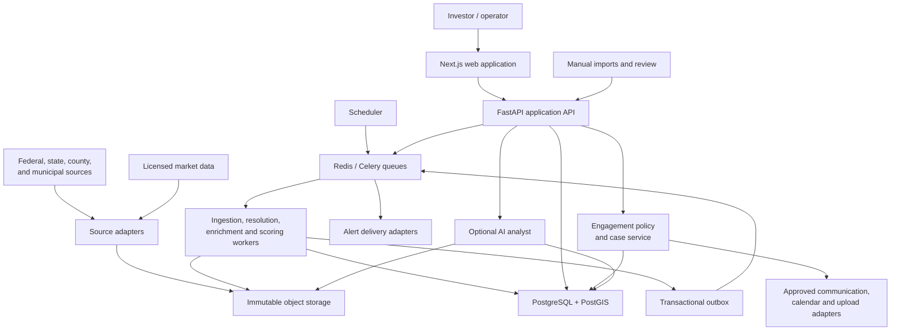

# System architecture

## 1. Architectural objective

Build one coherent product that can launch quickly in three Texas counties while making geography, source access, scoring policy, and Opportunity Zone law replaceable/versioned inputs.

The first implementation is a **modular monolith with multiple runtime processes**:

- one backend codebase with enforced bounded contexts;
- separate API, worker, and scheduler entrypoints;
- one transactional PostGIS database;
- asynchronous jobs and an outbox for decoupling;
- precomputed read models for the operator experience.

This gives the MVP transactional simplicity and low operational cost while preserving clean seams for later service extraction. A module becomes a service only when it has a demonstrated independent scaling, reliability, security, data-sovereignty, or team-ownership need.

## 2. System context



Only the web and API receive public network traffic. Workers, scheduler, Redis, PostGIS, and internal telemetry remain private.

## 3. Bounded contexts

Each context owns its tables, commands, invariants, and emitted events. Cross-context writes go through application services, not arbitrary SQL. Read models may denormalize across contexts.

### 3.1 Platform

Owns organizations, users, roles, authentication identities, feature flags, audit events, secrets references, and export policies.

Initial scope is one organization and one operator, but audit and tenancy keys are added where inexpensive. Contact data, source credentials, and exports have explicit authorization checks.

### 3.2 Geography registry

Owns countries, states/territories, counties/equivalents, municipalities, ETJs, corridors, reference points, time zones, FIPS codes, boundary versions, and geography relationships.

It also owns region-pack registration. Core modules ask this context questions such as “which jurisdictions and capabilities cover this parcel?” rather than checking county names.

### 3.3 Source registry and acquisition

Owns source definitions, adapter versions, capability declarations, access/terms metadata, schedules, cursors, rate limits, runs, manifests, and health.

Fetching and parsing are separate stages. A fetch stores bytes and metadata first. Normalization can then be replayed from the stored artifact without contacting the source again.

### 3.4 Observations and provenance

Owns immutable raw-record pointers, source documents, normalized observations, extraction evidence, field units, effective/transaction time, confidence, conflicts, and resolution decisions.

An observation is a claim by a source. A resolved fact is the platform's current selection or derived range. The original observation is never overwritten.

### 3.5 Parcel and entity identity

Owns canonical parcels, source-system parcel identifiers, identifier history, parcel split/merge relationships, addresses, candidate assemblages, owners/entities, aliases, ownership interests, and match decisions.

Identity merges are reversible. Low-confidence or ambiguous matches enter a manual queue. A common personal name is never enough to merge owners.

### 3.6 Geospatial enrichment

Owns versioned GIS layers and parcel intersections/metrics: flood, wetlands, wildfire, slope/elevation, zoning, jurisdiction, city/ETJ, roads/frontage, transmission/pipeline screening, utilities, airports, stadiums, transit, and Opportunity Zone tracts.

Derived results record source-layer version, geometry version, algorithm version, timestamp, and quality flags.

### 3.7 Market and valuation

Owns listings and listing snapshots, sales observations, comparables, value estimates, acquisition-cost scenarios, holding/remediation inputs, offer ranges, and auction clearing-price scenarios.

Appraised value is an input, never an alias for market value. Every estimate has low/base/high values, methodology version, comparable set, date, and confidence.

### 3.8 Signals and events

Owns deterministic distress, motivation, opportunity, risk, and material-change signals. It converts observation/fact changes into durable property events.

Signal rules are versioned and retain evidence. Event deduplication is transactional.

### 3.9 Underwriting and ranking

Owns strategy definitions, scenario assumptions, score-model versions, component scores, risk deductions, confidence adjustment, rank smoothing, composition preferences, explanations, and ranking snapshots.

It never calls an LLM for numerical decisions. Ranking reads stable inputs for a declared `as_of` time and writes an immutable run plus a current read model.

### 3.10 Deal operations

Owns watchlists, notes, research tasks, next actions, deal status, offers, auction checklists, acquisition outcomes, and feedback labels.

This is intentionally CRM-lite. It consumes engagement outcomes and can request a new outreach case, but it does not own contact points, messages, suppressions, or permissions.

### 3.11 Engagement

Owns contact-point observations, permitted-use metadata, permissions/consent, suppressions, outreach cases, participants, versioned policy preflights, exact-message approvals, communications, provider/manual attempts, replies, appointments, information requests, document submissions, and engagement outcomes.

Identity remains authoritative for entities and source-supported property-party roles. Engagement cannot create a party relationship merely to make a contact endpoint usable. Initial contact is case-based and human-approved; production sends fail closed on missing/stale policy, identity, source, approval, or suppression inputs. SMS, automated dialing, prerecorded/artificial voice, bulk campaigns, and unattended sequences are disabled.

See [Owner and representative outreach](OUTREACH_WORKFLOW.md) and [ADR 0005](adr/0005-policy-gated-human-outreach.md).

### 3.12 Alerts and briefs

Owns alert rules, deduplication, delivery preferences, delivery attempts, Top-25 movement summaries, and daily briefs.

It consumes durable events and never independently infers property facts.

### 3.13 AI analyst

Owns prompts, model configuration, source citations, generated summaries, review state, and cost/latency logs.

Permitted tasks include document summaries, thesis drafts, rank explanations, clause extraction, parcel comparison, and due-diligence checklist drafts. Structured facts, geospatial results, values, acreage, zoning, and scores remain authoritative outside this context.

## 4. Core conceptual model

The word “property” is too ambiguous for storage design. Use these distinct entities:

| Concept | Meaning |
|---|---|
| `Parcel` | A canonical assessed/cadastral land unit with identifier history and geometry versions |
| `ParcelIdentifier` | A jurisdiction/source-scoped APN, account, geographic ID, or alternate identifier |
| `InvestmentCandidate` | The unit being ranked; one parcel or an assemblage of several parcels |
| `Listing` | A time-varying marketing record that may cover one or more parcels |
| `Entity` | A person, organization, trust, estate, public body, or unresolved party |
| `OwnershipInterest` | A source-supported relationship between owner and parcel during an interval |
| `PropertyPartyAssignment` | A source-supported entity role and authority scope for a property/candidate |
| `Observation` | A source's assertion about an entity or attribute |
| `ResolvedFact` | The selected current value/range plus the evidence and resolution policy used |
| `PropertyEvent` | A durable, deduplicated material or historical change |
| `UnderwritingScenario` | Versioned assumptions and outputs for one candidate and strategy |
| `Deal` | The operator's pursuit of a candidate through an acquisition workflow |
| `OutreachCase` | A declared, policy-reviewed purpose for communicating with verified property parties |
| `Appointment` | A participant-confirmed call, meeting, site visit, inspection, or records review |
| `InformationRequest` | A structured request for property evidence with item-level status and controls |

This separation supports parcel splits, assemblages, relisted properties, conflicting ownership records, and multiple concurrent acquisition strategies.

## 5. Data layers and PostgreSQL schemas

Use one PostGIS database initially, separated into schemas with explicit ownership:

| Schema | Purpose | Mutation pattern |
|---|---|---|
| `platform` | users, organizations, audit, feature flags | transactional |
| `registry` | jurisdictions, region packs, sources, policies | versioned/configured |
| `raw` | source runs, records, artifact pointers, checksums | append-only |
| `observation` | normalized claims, documents, conflicts, lineage | append-only plus resolution state |
| `identity` | parcels, identifiers, candidates, entities, ownership | transactional with history |
| `geo` | layer versions, geometry, intersections, derived metrics | versioned/rebuildable |
| `market` | listings, sales, comps, estimates, scenarios | append/snapshot |
| `intelligence` | signals, events, scores, rankings, explanations | append/snapshot plus read model |
| `deal` | watchlists, tasks, notes, offers, acquisition stages/outcomes | transactional |
| `engagement` | contact points, policy decisions, suppressions, communications, appointments, information requests | sensitive transactional/history |
| `delivery` | alerts, briefs, delivery attempts | transactional/history |
| `readmodel` | denormalized dashboard, map, detail projections | rebuildable |

Do not use schemas as the only module boundary. Backend packages and database roles/migration ownership enforce the same separation.

### 5.1 Bitemporal records

Important observations and designations carry:

- `effective_from` / `effective_to`: when the claim is valid in the real world;
- `recorded_at`: when Seek and Score learned it;
- `superseded_at`: when the platform stopped treating that version as current.

This permits “what was true on date X?” and “what did we know on date X?” analysis, which is required for reproducing historical rankings and evaluating discovery latency.

### 5.2 Units and money

- Store money as integer cents plus ISO 4217 currency.
- Store areas in square meters as canonical units; expose acres/square feet as conversions.
- Store distances in meters and durations in seconds.
- Store ratios as bounded decimals, not formatted percentages.
- Store geodetic geometry in EPSG:4326 and use appropriate projected SRIDs for area/distance calculations.
- Version rounding rules and preserve pre-rounded calculation inputs.

## 6. Immutable acquisition pipeline


### 6.1 Adapter contract

Every source adapter implements equivalent concepts, even if provider mechanics differ:

```python
class SourceAdapter(Protocol):
    descriptor: SourceDescriptor

    async def discover(self, cursor: Cursor | None) -> DiscoveryBatch: ...
    async def fetch(self, reference: SourceReference) -> RawArtifact: ...
    def parse(self, artifact: RawArtifact) -> Iterable[ObservationEnvelope]: ...
    async def probe(self) -> SourceHealth: ...
```

`SourceDescriptor` declares:

- jurisdiction and capabilities;
- authority and source URLs;
- access method and authentication;
- terms/license URL and acceptance date;
- allowed storage, retention, display, export, and redistribution;
- expected cadence/freshness SLA;
- rate/concurrency limits;
- identifiers and geographic vintage;
- parser schema and adapter versions;
- classification of personal/restricted data.

Parsing has no network access. Given an artifact, adapter version, and configuration version, it must emit identical normalized observations.

### 6.2 Idempotency keys

Use stable, layered keys:

- Fetch: `(source_id, upstream_reference, upstream_version_or_effective_date)`
- Raw artifact: SHA-256 content hash
- Observation: `(source_record_id, subject, field, effective_interval, parser_version)`
- Job: `(job_type, source_or_subject, requested_as_of, configuration_version)`
- Event: `(subject, event_type, evidence_hash, effective_at)`
- Alert: `(user, rule_version, event_id, channel)`

Database constraints enforce these keys; application checks alone are insufficient.

### 6.3 Replay

Every parser/enrichment/scoring release must support bounded replay by source, jurisdiction, artifact date, parcel, or model version. Replays create new derivations and record lineage; they do not mutate the raw artifact or pretend the new parser existed at the original retrieval time.

## 7. Identity resolution

### 7.1 Parcel identity

The minimum source-scoped parcel identity is:

```text
(state_fips, county_fips, source_system, local_parcel_id)
```

Canonical matching considers authoritative crosswalks, normalized identifiers, legal description, site address, centroid/polygon, acreage, subdivision/lot, and temporal consistency. Each feature is evidence, not an unconditional join.

Parcel lineage explicitly models `SPLIT_FROM`, `MERGED_FROM`, `RENUMBERED_FROM`, and `SAME_AS` with confidence, effective date, source, and review state.

### 7.2 Entity identity

Normalize case, punctuation, legal suffixes, address formatting, and known aliases. Organizations may use registration IDs when lawfully available. Individuals require stronger evidence than a normalized name; mailing address and temporal ownership can help, but common-name matches remain conservative.

Automatic thresholds are calibrated on a reviewed gold set. Medium confidence enters a review queue. Low confidence remains separate.

### 7.3 Manual decisions

Every merge/split/override records actor, time, evidence, reason, previous state, and reversibility. A manual decision can be superseded, never silently deleted.

## 8. Geography and region packs

A region pack is versioned configuration and adapter registration, not executable county-specific business logic.

```yaml
schema_version: 1
id: us-tx-central-texas
version: 0.1.0
jurisdictions:
  - country: US
    state_fips: "48"
    county_fips: "453"
    timezone: America/Chicago
capabilities:
  assessor: planned
  tax_foreclosure: planned
  court: manual
reference_points:
  - id: aus_airport
    kind: airport
scoring_profile: central-texas-v1
```

A pack declares:

- jurisdiction IDs and time zones;
- enabled source instances and capability status;
- schedules/freshness SLAs;
- authoritative local GIS layers;
- named corridors/reference points;
- normalized local property/use mappings;
- permitted regional score overrides;
- compliance and access notes;
- rollout state: `development`, `shadow`, `review`, or `active`.

Core code may depend on capabilities such as `tax_foreclosure` or `zoning`, never on `Travis County` conditionals.

## 9. Opportunity Zone model

Opportunity Zones are a versioned federal-policy layer in the geography registry.

Minimum entities:

- `program`: statutory program and authority;
- `designation_round`: 2018, 2027, and future decennial cohorts;
- `tract_designation`: tract, Census vintage, status, authority, certification/effective/expiry dates, rural flag and source;
- `tract_geometry_version`: frozen legal boundary source and checksum;
- `parcel_designation_membership`: point/area relationship, overlap metrics, algorithm and confidence;
- `policy_rule_version`: date-bounded rules used by scenario models;
- `tax_scenario`: user assumptions and modeled effects, explicitly non-authoritative.

Statuses include `eligible`, `state_nominated`, `treasury_certified`, `effective`, `expired`, `withdrawn`, and `superseded`. A status transition appends a new fact/effective interval.

The 2018 cohort retains 2010-vintage legal tract geography. The 2027 cohort uses 2020 Census tract numbers/boundaries. Relationship files may support analysis across vintages but never transfer a legal designation.

See [Opportunity Zone and national data design](OPPORTUNITY_ZONES_AND_DATA.md).

## 10. Deterministic underwriting and ranking

### 10.1 Calculation order

1. Select an `as_of` time, candidate, region-pack version, source/fact snapshot, and score-model version.
2. Apply Top-25 data-quality eligibility gates.
3. Calculate factual/derived features, freshness, and per-feature confidence.
4. Execute each applicable strategy underwriting model.
5. Calculate positive component score and explicit risk deductions.
6. Clamp the opportunity score to 0–100.
7. Apply confidence adjustment.
8. Apply smoothing unless a material event bypasses it.
9. Apply soft composition preferences to the Top-25 selection, without excluding exceptional candidates.
10. Persist all inputs, components, assumptions, explanations, and ranks.
11. Compare with the prior snapshot and emit deduplicated movement events.

### 10.2 Baseline formula

```text
positive =
  0.25 * investment_quality +
  0.20 * discount_potential +
  0.15 * location_growth +
  0.15 * development_optionality +
  0.10 * motivation_distress +
  0.05 * liquidity +
  0.05 * lifestyle_value +
  0.05 * information_confidence

opportunity_score = clamp(positive - risk_penalty, 0, 100)

rank_adjusted = opportunity_score * (0.75 + 0.25 * confidence)

display_score = material_event
  ? rank_adjusted
  : 0.85 * rank_adjusted + 0.15 * prior_display_score
```

Exact component definitions, caps, null behavior, and normalization live in a versioned scoring profile. Missing evidence must not become a favorable zero-risk assumption.

### 10.3 Material events

Examples include foreclosure filing/dismissal, auction scheduling/removal, sale, tax resolution, price change over a versioned threshold, zoning change, access/title risk discovery, or a major comparable changing value materially.

### 10.4 Explainability

Every result exposes:

- model and region-pack versions;
- resolved input values and observation links;
- contribution and deduction per component;
- assumptions and unknowns;
- confidence/freshness effects;
- prior/current rank and material changes;
- the recommended verification/next action.

## 11. API and read models

Use REST/OpenAPI for the initial application boundary. Generate the TypeScript client from the API contract in CI.

Initial resources:

```text
GET  /v1/candidates
GET  /v1/candidates/{id}
GET  /v1/candidates/{id}/observations
GET  /v1/candidates/{id}/conflicts
GET  /v1/candidates/{id}/timeline
GET  /v1/candidates/{id}/scores
GET  /v1/candidates/{id}/comparables
GET  /v1/candidates/{id}/opportunity-zones

GET  /v1/rankings/{strategy}
GET  /v1/map/candidates
GET  /v1/events
GET  /v1/daily-brief
GET  /v1/auctions
GET  /v1/owners/{id}/portfolio
GET  /v1/candidates/{id}/responsible-parties

POST /v1/candidates/{id}/watch
POST /v1/candidates/{id}/pass
POST /v1/candidates/{id}/notes
POST /v1/deals
PATCH /v1/deals/{id}
POST /v1/candidates/{id}/outreach-cases
POST /v1/outreach-cases/{id}/preflight
POST /v1/outreach-cases/{id}/communications/draft
POST /v1/communications/{id}/approve
POST /v1/communications/{id}/send
POST /v1/communications/{id}/record-manual-attempt
POST /v1/outreach-cases/{id}/appointments
POST /v1/outreach-cases/{id}/information-requests
POST /v1/suppressions
```

Dashboard endpoints read denormalized projections. They never synchronously fetch a county source, run a spatial overlay, invoke an LLM, or recompute the entire ranking.

Use cursor pagination, conditional requests/ETags, explicit units, ISO-8601 timestamps, and stable enum values. API errors follow one documented problem-details schema.

## 12. Asynchronous processing

Celery with Redis is the MVP execution layer. Postgres stores authoritative run/job state, deduplication, results, and the transactional outbox. Redis is replaceable infrastructure, not the only record of work.

Initial queues:

- `acquire`: network-bound fetching with source-specific concurrency/rate limits;
- `parse`: CPU/memory-bounded parsing/OCR;
- `resolve`: parcel/entity matching and review-queue generation;
- `geo`: spatial overlays and metrics;
- `market`: comps and valuations;
- `score`: signals, underwriting, rankings, read models;
- `deliver`: alerts, briefs, and optional AI summaries.
- `engage`: authenticated inbound callbacks, approved provider handoff, appointment reconciliation, and restricted-document scanning; no job can create its own recipient or approval.

Workers acknowledge after durable writes, handle SIGTERM, use bounded retries with jitter, and route exhausted failures to a dead-letter state visible in operations UI.

The scheduler only places deduplicated work requests. It does not perform long ingestion inside the scheduled process.

## 13. Search and maps

Use Postgres full-text/trigram search for MVP. Add OpenSearch only when measured query/index requirements justify a separate system.

Map endpoints return simplified geometry or vector tiles by zoom level, never full county parcel polygons for an unconstrained viewport. Use bounding-box and score filters, spatial indexes, cached tiles/projections, and a server-side detail fetch for selected parcels.

## 14. Security and privacy architecture

- Authentication at the web/API edge; authorization in application services.
- Environment-specific least-privilege database, object-store, source, and delivery credentials.
- Production secrets only in Railway sealed variables or an approved secret manager.
- Audit access to owner contact data, exports, deal changes, and administrative decisions.
- Encrypt sensitive exports and set retention/deletion policies by data class/source rights.
- Sanitize logs and traces; use stable internal IDs rather than owner names or source credentials.
- Human confirmation before contact/offer/auction actions.
- Fresh policy preflight and exact-content approval immediately before any engagement-provider handoff.
- Central suppression/permission checks at draft, approval, queue, and send boundaries; late revocation cancels pending work.
- Contact endpoints, message bodies, and restricted documents are redacted from logs/traces/public fixtures and audited on access/export.
- Engagement providers default off per environment/channel; preview deployments cannot contact real parties.
- Apply source-specific redistribution and display rules to API and export paths.
- Separate public/open fixtures from real owner, licensed MLS, court-document, and contact datasets.

## 15. Observability

Every job/log/trace carries:

```text
environment, service, deployment_id, trace_id,
source_id, jurisdiction_id, source_run_id, job_id,
candidate_id/parcel_id when appropriate,
adapter_version, parser_version, config_version, score_version
```

Core metrics:

- source success, freshness, response/change rate, and throttling;
- records fetched, parsed, rejected, matched, and unresolved;
- parcel/entity match precision sampling and review-queue age;
- queue depth, oldest-job age, retry/dead-letter count, and throughput;
- spatial enrichment coverage and duration;
- ranking duration, movements, and explanation completeness;
- API latency/error rate and read-model age;
- database connections, slow queries, locks, bloat, and storage;
- backup age and last verified restore;
- alert delivery rate and duplicate suppression.

Railway deployment health checks gate releases only. External uptime monitoring and application telemetry provide continuous health.

## 16. Scale path

### Stage A: Central Texas MVP

One PostGIS database, Redis, API, web, one or two worker pools, scheduler, and external object storage. Partition large append-only tables only when measured size requires it.

### Stage B: Multi-market platform

Add queue routing by source/jurisdiction, multiple worker replicas, PgBouncer, materialized/read projections, object lifecycle policies, and date/source partitioning for raw observations and events.

Prove the region-pack model with one non-Texas market that differs in assessor access, parcel IDs, sale disclosure, foreclosure process, zoning, and time zone.

### Stage C: National portfolio

Introduce a source-control plane, adapter certification tests, vendor datasets/crosswalks, workload quotas, region activation workflow, and explicit data-residency/retention policy. Consider extracting high-volume acquisition/document processing, engagement, and notification delivery.

Move PostGIS to managed HA before strict availability objectives or single-node storage exceeds accepted recovery risk. Read replicas, lakehouse/warehouse analytics, and search services follow measured workloads rather than geography count alone.

## 17. Failure behavior

- Source unavailable: retain last good facts, mark source stale, lower confidence, alert operations; do not zero the data.
- Parser regression: quarantine invalid observations and replay from raw after rollback/fix.
- Ambiguous identity: research queue; never force-match to reach Top 25.
- Conflicting authoritative facts: preserve range/conflict and block calculations that require certainty.
- Redis loss: rebuild cache/queues from authoritative pending jobs/outbox; do not lose raw or score history.
- Worker interruption: safely retry idempotent job after visibility timeout.
- Ranking failure: continue serving the last completed snapshot with age warning.
- AI failure: omit narrative; structured facts and decisions remain available.
- Engagement provider failure: preserve the approved communication and policy decision, show uncertain/failed delivery, reconcile idempotently, and never retry after a new suppression.
- PostGIS failure: restore from tested snapshot/logical backup according to declared RPO/RTO.

## 18. Extraction criteria

Do not split a module into a network service until one or more are true and measured:

- it requires independent horizontal or regional scaling;
- its failure must be isolated from the API;
- it has a distinct data-access/security boundary;
- release cadence or ownership is independent;
- a different persistence technology is justified;
- it consumes enough resources to harm colocated workloads.

Any extraction must retain idempotency, event versioning, traceability, and a compatibility/migration plan.
