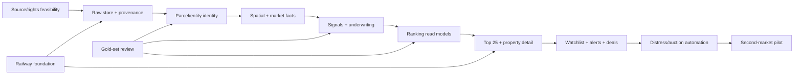

# Implementation plan

## 1. Executive plan

Deliver Seek and Score as a sequence of end-to-end, evidence-backed vertical slices:

1. Prove that critical Central Texas data can be accessed and retained lawfully.
2. Build the immutable/provenance and parcel-identity foundation before broad UI work.
3. Complete one Travis County source-to-ranking slice with synthetic/manual market data.
4. Expand the same contracts to Bastrop and Caldwell, then launch the operator Top 25.
5. Add automated distress, owner portfolio, auction, and specialized underwriting.
6. Prove national modularity by onboarding one deliberately dissimilar Opportunity Zone market outside Texas.
7. Scale sources/markets through region packs, adapter certification, and operational controls.

The MVP is not “all features in the original vision.” It is the smallest system that reliably ingests approved sources, resolves parcels, shows provenance, calculates deterministic scores, and gives one operator a better Top-25 decision queue.

## 2. Planning assumptions

- Launch organization: one operator, one production organization.
- Launch counties: Travis, Bastrop, and Caldwell, Texas.
- Deployment: Railway application services, initial Railway PostGIS/Redis, S3-compatible raw artifact storage.
- Backend: Python 3.13+ target, FastAPI, SQLAlchemy/Alembic, Celery.
- Frontend: current supported Next.js/React/TypeScript, Tailwind, accessible component primitives, MapLibre-compatible maps.
- Database: PostgreSQL 16+ with a tested PostGIS version; exact versions pinned during scaffold.
- Listings: one licensed/approved feed or a documented manual import for initial validation. No assumed Zillow/MLS scraping.
- Court/recorder automation: manual import/flagging is acceptable in the first launch slice.
- Scoring: deterministic, versioned, reviewed against a gold set; AI never supplies numerical truth.
- Opportunity Zones: cohort/status/effective-date aware; the 2027 cohort is provisional until Treasury certification/effectiveness.
- Schedule estimates are ranges, not commitments; source access and data licensing are the critical path.

## 3. Delivery model

### Recommended lean team

- Product owner/investor: strategy definitions, manual review, source relationships, underwriting acceptance
- Data/GIS engineer: adapters, identity, observations, spatial layers, data quality
- Full-stack engineer: API, web, deal workflow, platform/reliability
- Fractional review: real-estate attorney/tax adviser, security/privacy, UX/accessibility as needed

With two experienced engineers plus an engaged product owner, a credible operator MVP is approximately **16–24 elapsed weeks** after source access is unblocked. A solo build is more plausibly **24–36+ weeks**. Automated court/recorder, robust comps, and multi-state coverage are later increments.

### Work-in-progress rule

Each milestone delivers one demonstrable user flow, migrations, fixtures, observability, and operations documentation. Do not start several county adapters without completing replay, identity, provenance, and source health for the preceding slice.

## 4. Dependency map

## 5. Cross-cutting workstreams

### 5.1 Product and UX

- Define property/candidate decision cards and the ten-second detail header.
- Prototype Top 25, daily brief, source evidence/conflicts, research queue, map, and deal next actions.
- Establish terminology for verified, observed, derived, estimated, preliminary, stale, conflicting, and unknown.
- Test with real manual underwriting cases before polishing secondary dashboards.

### 5.2 Source governance

- Maintain a source inventory and adapter readiness state.
- Record authority, terms, access, cadence, identifiers, retention/display/export/redistribution rights, and personal-data class.
- Add change monitoring and a kill switch per source.
- Keep licensed and personal data out of the public repository and preview environments.

### 5.3 Data platform

- Immutable artifact storage, append-only raw metadata, checksums, schema/parser versions, replay, idempotency, job ledger, and lineage.
- Bitemporal observations and resolved facts.
- Versioned schema migrations and safe backfills.

### 5.4 Identity and quality

- Canonical parcel identifiers/geometry history.
- Candidate assemblages, listing relationships, owner/entity aliases, and ownership intervals.
- Explainable match features, thresholds, research queue, reversible manual decisions, and gold-set metrics.

### 5.5 GIS and policy

- Boundary registry and frozen legal geography.
- Flood, jurisdiction, transport/reference-point, hazards, zoning where authoritative, and Opportunity Zone cohorts.
- Versioned intersection metrics and map tile/generalization strategy.

### 5.6 Market and underwriting

- Listings/sales observations, comparable rules, value ranges, acquisition-cost scenarios, and confidence.
- Deterministic strategy models and explicit risk deductions.
- Versioned rank smoothing, material-event bypass, composition preferences, and explanations.

### 5.7 Application and deal operations

- OpenAPI contract, generated client, auth, Top 25, detail, map, feed, watchlist, tasks/notes, daily brief, alerts, and CRM-lite status.
- Responsible-party review, policy-gated outreach cases, central suppression, individually approved communication, appointment coordination, and structured information requests.
- Accessibility and responsive field use.

### 5.8 Reliability and security

- Railway config, staging/production isolation, source kill switches, health, shutdown, telemetry, backups/restore, CI/CD, dependency/container/secret scanning, audit, and incident response.

## 6. Milestones

## Milestone 0 — feasibility and decisions

Estimated elapsed time: 1–3 weeks. This milestone can reveal that a source needs procurement or manual fallback; it is intentionally before major implementation.

### Deliverables

- Approved vocabulary: parcel, candidate, listing, observation, fact, event, score, deal.
- Source inventory for all three counties covering assessor/parcel, tax/foreclosure, court, recorder, GIS, zoning, auction, and listing access.
- One representative raw sample and schema notes per critical source.
- Written access/rights record and preferred mechanism for every source.
- Listing-data decision: licensed feed, partner export, or manual import.
- Map/geocoder, authentication, alert channel, and object-storage decisions.
- Outreach discovery: responsible-party roles/authority evidence, contact sources and permitted use, campaign classifications, federal/Texas applicability review, suppression/retention, safe frequency, and initial email/calendar/upload provider decision.
- Opportunity Zone 2018 and 2027 official dataset inventory with cohort/vintage/status rules.
- A manually reviewed benchmark set of 100–300 representative parcels/candidates, including duplicates, address mismatch, split/merge, boundary, distress, and bad-deal examples.
- Scoring workshop: component definitions, risk caps, unknown treatment, strategy applicability, and example ranking.
- Initial cost ceiling, RPO/RTO acceptance, and public-repository license decision.

### Exit criteria

- At least one approved bulk/API/export path exists for core assessor/parcel data.
- A usable parcel geometry source exists for the first vertical slice.
- A lawful initial market/listing input exists, even if manual.
- The product owner can manually rank the benchmark and explain the top/bottom cases.
- Unblocked sources cover enough fields to meet the minimum Top-25 eligibility gate.

### Stop/replan triggers

- Critical sources prohibit required retention/use.
- Parcel geometry/identifier coverage cannot support safe resolution.
- No usable price/value signal can be obtained.
- Source costs exceed the accepted MVP budget.
- No approved owner/representative contact source or campaign/channel policy exists; retain research and manual deal tracking but defer external-send capability.

## Milestone 1 — engineering foundation and Railway staging

Estimated elapsed time: 2–4 weeks.

### Deliverables

- Monorepo scaffold for web, API, workers, shared contracts/UI, backend modules, migrations, and region configuration.
- Pinned toolchains and lockfiles; lint, format, static analysis, unit-test, migration, secret, and container checks in CI.
- Local development stack with PostGIS, Redis, object-storage emulator/adapter, and synthetic fixtures.
- Railway staging project with private PostGIS/Redis, web/API/worker/scheduler services, health endpoints, reference variables, and ingestion disabled by default.
- Authentication and one-organization authorization skeleton.
- Core registries: jurisdiction, geography version, source, source policy, adapter version, region pack.
- Raw artifact metadata/object storage, source run ledger, idempotent job ledger, transactional outbox, retries/dead-letter state.
- Structured logging, traces, source/job metrics, external error tracking, and uptime check.
- Backup schedule, off-project logical backup, restore script/runbook, and a successful staging restore.

### Acceptance criteria

- Replaying the same fixture three times creates no duplicate raw record, observation, event, job, or alert intent.
- Killing a worker mid-job yields a safe retry and one final durable result.
- A failed parser is quarantined without losing raw bytes.
- Production ingestion cannot be activated from a PR environment.
- Staging restore reconstructs extensions, schema, fixtures, spatial indexes, and sample queries.
- CI can build the exact Railway images/configuration from a clean checkout.

## Milestone 2 — Travis County vertical slice

Estimated elapsed time: 3–5 weeks.

### Scope

Complete one source-to-Top-25 path before adding counties:

- one approved Travis assessor/parcel source;
- parcel geometry;
- FEMA flood layer;
- 2018/2027 Opportunity Zone layers and designation status;
- tax-foreclosure inventory;
- approved listing or manual market import;
- manual court/distress flag input.

### Deliverables

- Source adapters and immutable fixtures for each slice source.
- Observation schema, normalization, units, provenance, conflicts, and resolution policy.
- Canonical parcel model, identifier history, geometry versions, candidate/listing relationships.
- Deterministic parcel matching plus manual review queue.
- GIS enrichment for flood, jurisdiction, distance/reference points, and OZ membership.
- Source-health/freshness dashboard.
- Basic value low/base/high and comparable selection with transparent inputs.
- Minimal candidate API and an internal evidence/debug view.

### Acceptance criteria

- Automatic parcel matching reaches at least 99% precision and 90% recall on the reviewed Travis gold set; ambiguous cases are not forced.
- Every canonical field returned by the API links to one or more observations/resolution logic.
- GIS fixtures include parcels wholly inside, wholly outside, and crossing a tract/flood boundary.
- Legacy and 2027 Opportunity Zone cohorts can overlap without overwriting one another.
- A source schema change produces an explicit failure/alert rather than corrupt canonical facts.
- The same source/fact snapshot produces byte-for-byte equivalent normalized calculation inputs.

## Milestone 3 — deterministic intelligence and Top 25

Estimated elapsed time: 3–5 weeks; can overlap late Milestone 2 once schemas stabilize.

### Deliverables

- Versioned feature definitions and score model.
- Independent investment, buildability, lifestyle, distress, parking, redevelopment, land-bank, dealability, risk, and confidence components where data supports them.
- Data-quality eligibility gate and research queue.
- Value/acquisition/deal-spread scenarios.
- Material-change detection and durable property events.
- Overall and strategy ranking runs, smoothing, soft composition preferences, immutable snapshots, and current read models.
- Structured explanations, movement explanations, next-action rules, and score regression fixtures.

### Acceptance criteria

- Every score is reproducible from persisted model/config/input versions.
- Every component shows its input, contribution/deduction, freshness, confidence, and evidence.
- Missing access/zoning/utility evidence cannot silently improve the score.
- Material events bypass smoothing; small non-material changes do not create excessive churn.
- Top-25 composition preferences never exclude an exceptional candidate solely because a category is full.
- The product owner manually reviews the top, middle, and rejected benchmark cohorts and signs off on v1 behavior.

## Milestone 4 — operator MVP and three-county expansion

Estimated elapsed time: 4–7 weeks.

### Deliverables

- Bastrop and Caldwell region/source configurations and approved adapters.
- Top 25 overall and strategy views with geography/price/strategy filters.
- Responsive map with score styling and versioned flood/OZ/jurisdiction overlays.
- Property/candidate detail with thesis, value range, risks, unknowns, score breakdown, sources/conflicts, and timeline.
- New-opportunity feed, daily brief, watch/pass, notes/tasks, and next actions.
- Meaningful alert rules with deduplicated in-app/email delivery (channel subject to decision).
- Operator authentication, audit, export restrictions, and source-rights enforcement.
- Production Railway environment deployed first in shadow mode, then activated after review.

### Launch acceptance criteria

- 100% of Top-25 candidates pass identity/location/ownership/value gates.
- 100% of material Top-25 facts and score inputs expose provenance.
- No known duplicate parcel/candidate appears in the same ranking snapshot.
- Ranking/read model age and every source's last-check time are visible.
- Dashboard p95 server response is under 1.5 seconds and detail under 2 seconds on the agreed dataset/load; no route performs live source ingestion.
- Map stays usable through viewport filtering/generalized geometry on representative county data.
- Watch/pass/note/task actions survive backup/restore.
- A full daily refresh and one auction/tax update cycle complete without duplicate events/alerts.
- Source failure serves last-known facts with a stale warning rather than an empty/false state.
- Security, recovery, and single-node PostGIS risk are explicitly accepted for launch.

At this point the system is a usable operator MVP.

## Milestone 5 — distress, owner portfolio, and auction operations

Estimated elapsed time: 4–8 weeks, highly source-dependent.

### Deliverables

- Automated or carefully controlled manual-assisted District Clerk/court case ingestion.
- County Clerk/trustee foreclosure notices and instrument/document metadata where allowed.
- Owner/entity resolution, alias review, ownership history, and related-parcel portfolio.
- Auction inventory, title/redemption/as-is warnings, expected clearing-cost scenario, maximum-bid engine, checklist, and outcomes.
- Property-party roles and authority evidence for owners, managers, brokers, trustees/executors, attorneys, registered agents, and public officers without conflating routing with sale authority.
- Engagement schema: contact-point provenance/permitted use, permissions, suppressions, cases, preflight decisions, communications, appointments, information requests, documents, and outcomes.
- Outreach workspace with participant evidence, case timeline, explainable blocks, exact-content approval, stop action, and deal next action.
- Manual attempt logging and `.ics` appointment export first; a single-message email adapter and secure upload flow only after legal/security activation gates.
- Deal pipeline, offers, follow-ups, outcomes, and audit, linked to rather than owning engagement history.
- Automated land/commercial/residential comparable workflows where data supports them.

### Acceptance criteria

- Court/notice match confidence and evidence are visible; ambiguous parties never auto-merge solely by name.
- Every contact datum records source and allowed use.
- Every eligible recipient has a reviewed property role, authority scope, evidence, effective interval, and contact match; wrong-party reports stop work and return identity to review.
- Every provider send has a fresh passing policy preflight, exact-content human approval, suppression check, environment/channel kill switch, and immutable audit entry.
- Cold outreach is never automatically sent or treated as transactional because it proposes scheduling; SMS, automated dialing, prerecorded/artificial voice, bulk campaigns, and unattended sequences remain disabled.
- An opt-out, revocation, wrong-party report, disputed identity, or permanent bounce cancels pending work and invalidates unused approvals.
- Appointments require affirmative confirmation and preserve time zone/reschedule/cancel history; sensitive requested documents use restricted upload, scanning, authorization, audit, and retention controls.
- Engagement outcomes can update deal next actions but never automatically alter opportunity scores.
- Minimum bid is never used as likely acquisition cost without a separate model/scenario.
- Maximum-bid outputs include conservative value, all deductions, required margin, policy/model version, and professional-review status.
- Auction/deal outcomes feed calibration tables without altering historical score runs.

## Milestone 6 — specialized underwriting and Opportunity Zone scenarios

Estimated elapsed time: 4–7 weeks.

### Deliverables

- Parking capacity/cost/revenue scenarios with civil/zoning/access caveats.
- Zoning and permit automation where authoritative machine-readable data exists.
- Utility/septic/access evidence and uncertainty model.
- Offer opening/target/walk-away scenarios.
- Opportunity Zone development suitability and separate tax-scenario module.
- Qualified rural status ingestion from official data and policy-versioned substantial-improvement assumptions.
- AI analyst summaries constrained to selected observations/documents and internal citations, with review state and cost controls.

### Acceptance criteria

- Preliminary parking/site outputs are never displayed as approved capacity.
- Base property valuation is independent of modeled tax benefit.
- Eligible/nominated tracts cannot appear as effective/certified.
- Tax scenarios show cohort, policy version, dates, user inputs, unresolved legal/tax requirements, and a professional-review warning.
- AI output can be removed without changing any structured fact, score, or rank.

## Milestone 7 — non-Texas expansion pilot

Estimated elapsed time: 4–8 weeks after selecting and approving the market.

### Market selection criteria

Choose a market that challenges Texas assumptions:

- different disclosure regime;
- different foreclosure/tax-sale process;
- different assessor/recorder access and parcel identifiers;
- active 2027 Opportunity Zone interest;
- different zoning/permit availability;
- sufficient open/licensed data to complete an end-to-end slice.

### Deliverables

- New state/county region pack and source policy records.
- Adapters using existing source/observation/identity contracts.
- Local semantics mapping for property use, ownership, distress, auction, and zoning.
- Reviewed gold set and shadow rankings.
- Architecture report listing every core-code change required by the market.

### Exit criteria

- No core domain code branches on state/county name.
- At least 90% of new-market behavior is configuration or adapter implementation; any core change is a genuinely general capability with ADR/tests.
- The same Top-25/provenance/deal UI works without a fork.
- Parcel/OZ membership uses the correct geography vintage and effective cohort.
- Data-quality and freshness thresholds pass before activation.

Failure of these criteria is useful: revise the abstraction before adding more markets.

## Milestone 8 — national operating model

Ongoing, after the pilot proves the contracts.

### Capabilities

- Adapter certification kit and conformance test suite.
- Source-control plane for schedules, credentials references, kill switches, quotas, terms changes, and health.
- Standard region activation/shadow/review workflow.
- Vendor/aggregator strategy for parcel, deed, sales, zoning, and contact coverage.
- Partitioning/archival strategy for raw observations, events, and score runs.
- PgBouncer/managed HA PostGIS, managed queue, warehouse/lake analytics, and search only when measured.
- Role-based access, collaboration, and multi-organization isolation if commercialized.
- Outcome-calibrated models introduced only after sufficient unbiased labels and backtesting.

## 7. Initial data model delivery order

Create migrations in dependency order:

1. `platform.organization`, `platform.user`, `platform.audit_event`
2. `registry.jurisdiction`, `registry.geography`, `registry.geography_version`, `registry.region_pack`
3. `registry.source`, `registry.source_policy`, `registry.adapter_version`
4. `raw.source_run`, `raw.artifact`, `raw.source_record`, `raw.job`, `raw.outbox`
5. `observation.observation`, `observation.evidence`, `observation.conflict`, `observation.resolution_decision`
6. `identity.parcel`, `identity.parcel_identifier`, `identity.parcel_lineage`, `identity.address`, `identity.candidate`
7. `identity.entity`, `identity.entity_alias`, `identity.ownership_interest`
8. `geo.layer`, `geo.layer_version`, `geo.parcel_geometry`, `geo.parcel_metric`
9. `geo.oz_program`, `geo.oz_designation_round`, `geo.oz_tract_status`, `geo.parcel_oz_membership`
10. `market.listing`, `market.listing_snapshot`, `market.sale_observation`, `market.comparable_set`, `market.value_estimate`
11. `intelligence.signal_rule`, `intelligence.signal`, `intelligence.property_event`
12. `intelligence.score_model`, `intelligence.score_run`, `intelligence.score_component`, `intelligence.ranking_snapshot`
13. `identity.property_party_assignment`, `deal.watch`, `deal.note`, `deal.task`, `deal.deal`, `deal.offer`, `deal.outcome`
14. `engagement.contact_point`, `engagement.contact_permission`, `engagement.suppression_entry`, `engagement.outreach_case`, `engagement.participant`
15. `engagement.policy_decision`, `engagement.communication`, `engagement.approval`, `engagement.delivery_attempt`, `engagement.appointment`, `engagement.information_request`, `engagement.document_submission`
16. `delivery.alert_rule`, `delivery.alert`, `delivery.delivery_attempt`, `delivery.daily_brief`
17. `readmodel.top_candidate`, `readmodel.candidate_detail`, `readmodel.map_candidate`, `readmodel.source_health`

Every migration identifies its owning context, downgrade/forward-fix strategy, backfill plan, and compatibility window.

## 8. Test and validation strategy

### Unit and property tests

- Units, money, dates/time zones, score normalization, caps, null behavior, confidence, smoothing, material thresholds, and bid/offer formulas.
- Geometry validity, coordinate order, projected area/distance, boundary relations, and simplification.
- Identity normalization and match-feature generation.

### Adapter contract tests

Every adapter passes the same conformance suite:

- immutable fetch metadata and checksum;
- deterministic offline parse;
- schema validation and quarantine;
- stable source record IDs;
- pagination/cursor resume;
- rate limit/backoff/auth failure behavior;
- three-run idempotency;
- fixture scrubbing and rights metadata;
- source health/freshness output.

### Golden fixtures

Retain approved, sanitized examples for normal, edge, and failure cases. Parser changes intentionally update expected observations through code review; fixtures never contain production credentials or unnecessary personal data.

### Identity gold set

Human-label parcel/entity matches and non-matches. Report precision, recall, false-merge rate, false-split rate, and review-queue rate by source/jurisdiction. Optimize against false merges first.

### Scoring regression set

For each model version, store candidate inputs, expected components, penalties, confidence, display score, applicability, explanation facts, and relative ordering. Include attractive-but-unusable and cheap-but-risky counterexamples.

### Integration tests

- Raw artifact through observation, identity, facts, spatial metrics, signal, rank, read model, and alert intent.
- Transactional outbox and worker retry.
- Migration from prior release.
- Backup/restore and source replay.
- OpenAPI compatibility and generated client.

### End-to-end tests

- Sign in; review daily brief; filter Top 25; inspect evidence; watch/pass; add task/note; move deal; verify audit.
- Source becomes stale; UI retains last fact and lowers confidence.
- Material price/distress change creates one movement event and one alert.
- Boundary parcel shows correct OZ cohort/status/overlap.
- Resolve party; block an unverified endpoint; approve one exact message; suppress it before queue handoff; confirm no send occurs.
- Record wrong party, opt-out, bounce, appointment reschedule/cancel, and restricted document receipt without leaking contact/content to logs.

### Performance and failure tests

- Representative three-county dataset and viewport map load.
- Batch ingest and ranking duration under source-volume targets.
- Database restart, Redis loss, worker SIGTERM, parser failure, slow source, object-store retry, and stale read model.
- Connection-pool behavior while adding API/worker replicas.

### Security checks

- Static/dependency/container/secret scanning.
- Authentication/authorization negative tests.
- Export and source-rights enforcement.
- Owner/contact data absent from logs/traces/public fixtures.
- Outreach authorization, stale-approval, late-suppression, webhook-signature/replay, template-variable, and restricted-upload negative tests.
- Production ingestion and alert isolation from preview environments.

## 9. Proposed launch quality gates

These are starting targets and require product-owner approval during Milestone 0.

| Measure | MVP gate |
|---|---:|
| Raw artifact retention for successful fetches | 100% |
| Three-run ingestion duplicates | 0 |
| Auto parcel-match precision on gold set | >= 99% |
| Auto parcel-match recall on gold set | >= 90% |
| Top-25 unresolved parcel identity | 0 |
| Top-25 material facts with provenance | 100% |
| Score reproducibility for same version/snapshot | 100% |
| Duplicate material event/alert after replay | 0 |
| Enabled source runs meeting configured freshness SLA | >= 95% monthly, with visible exceptions |
| Critical source/schema failure visibility | < 15 minutes after failed run |
| Dashboard server response p95 | < 1.5 seconds |
| Candidate detail server response p95 | < 2 seconds |
| Latest successful backup age | within declared RPO |
| Verified restore age | < 35 days |

## 10. Observability and operational readiness

Before a source is active:

- owner and escalation path are recorded;
- success/failure/freshness metrics exist;
- last good cursor/artifact is visible;
- kill switch and replay command are tested;
- schema drift produces quarantine and alert;
- terms/access version is current;
- rate limits and backoff are configured;
- data-quality sample is reviewed.

Before production launch:

- dashboards exist for API, workers, queues, DB, Redis, source health, ranking age, and backups;
- on-call/incident expectations match the team size;
- source outage, data corruption, credential compromise, and database restore runbooks are exercised;
- operator can tell whether a missing result means “not present,” “not checked,” “failed,” “stale,” or “unresolved.”

## 11. Security, privacy, and compliance plan

### Phase 0 review topics

- Data-source terms, bulk access, automated access, retention, display, export, and redistribution.
- MLS/vendor contract and derived-data restrictions.
- Public-record personal-data handling and suppression/redaction.
- Contact-data sourcing, outreach channel rules, do-not-contact handling, and record retention.
- Fair-housing/anti-discrimination concerns in investment/owner-contact workflows.
- Court/foreclosure document storage and access.
- Map/geocoder attribution and derived-data terms.
- Public repository license versus private/licensed data rights.
- Legal/tax review of Opportunity Zone language and scenario disclaimers.

### Technical controls

- Least privilege and environment separation.
- Sealed secrets and credential rotation.
- Audit trails and sensitive export controls.
- Data classification and per-source policy enforcement.
- Retention/deletion jobs with legal hold capability where required.
- No AI training or third-party submission of restricted documents unless explicitly permitted.
- Human confirmation before any external contact, offer, or bid action.
- Party/authority evidence, source permitted use, fresh preflight, exact-content approval, central suppression, and environment/channel kill switches for outreach.
- No protected-class/proxy targeting or distress-based coercive content; channel/campaign/jurisdiction legal approval is versioned and fails closed when absent.

## 12. Risk register

| Risk | Probability / impact | Mitigation | Decision trigger |
|---|---|---|---|
| Listing/sales access unavailable or too expensive | high / high | manual/licensed fallback, source spike first, separate adapter | no viable path by Milestone 0 exit |
| Texas nondisclosure limits sold comps | high / high | licensed sources, conservative ranges, appraisal/listing context, confidence | cannot calibrate value spread |
| County automation prohibited/brittle | high / high | bulk/API first, controlled/manual import, adapter kill switch | terms or schema change |
| Parcel false merges | medium / severe | high precision threshold, temporal/geometry evidence, manual queue, reversible decisions | gold-set false merge |
| OZ 2027 list changes during nomination | certain / medium | cohort/status snapshots; provisional UI; Treasury promotion only | each official publication |
| Source facts imply false legal/title/access certainty | medium / severe | structured unknowns, professional-review gates, prominent risks | due-diligence workflow |
| Score overfits product-owner intuition | medium / high | reviewed benchmark, counterexamples, versioning, outcome calibration | ranking sign-off fails |
| Ranking churn/noise | medium / medium | material events, smoothing, deduplication, alert thresholds | excessive weekly churn |
| Single-node Railway PostGIS failure | medium / high | backups, restore tests, accepted RPO/RTO, managed HA gate | uptime/data volume/capital threshold |
| Worker/cron misses source window | medium / high | short dispatcher, durable jobs, freshness alerts, source-specific schedules | overlap/oldest-job threshold |
| Personal/licensed data leaks through public repo/logs | low / severe | synthetic fixtures, secret scanning, log policy, export controls | any incident or new source |
| Wrong party, prohibited contact, or outreach-policy failure | medium / severe | conservative identity review, source provenance, counsel-approved policy packs, suppression ledger, human approval, kill switches, immutable audit | complaint, wrong-party spike, policy/source change |
| Nationwide adapter burden grows nonlinearly | high / high | second-market pilot, source capability model, vendor strategy, activation gates | core branching or repeated custom work |
| Costs rise with geometry/documents/AI | medium / medium | budgets, per-source/service cost metrics, lifecycle, AI off by default | monthly ceiling reached |
| AI fabricates authoritative detail | medium / high | cited evidence only, no numeric authority, review state, optional failure | unsupported citation/claim |

## 13. Decision gates requiring owner input

The project can begin scaffolding, but these choices gate production scope:

- Which active-listing/sales source and budget?
- Is MVP strictly personal/single-user, or should invitations/collaboration ship?
- Which map/geocoder, auth, object-store, alert, and observability providers?
- What acquisition budget bands and required-return assumptions drive scoring?
- Which source facts are mandatory for Top-25 eligibility by strategy?
- Which first non-Texas market should test the region-pack model?
- What RPO/RTO and single-node PostGIS risk are acceptable?
- What repository license, if any?
- Which outreach channels and contact-data sources are allowed?
- Who approves each campaign/jurisdiction policy, which roles count as authorized representatives, and what frequency/retention limits apply?
- Which email/calendar/secure-upload providers are acceptable after manual-mode validation?

Track the live list in [DECISIONS.md](DECISIONS.md).

## 14. Definition of done for any feature

A feature is complete only when:

- user outcome and acceptance criteria pass;
- schema/API/event/config versions are explicit;
- provenance, freshness, confidence, and unknown/conflict states are handled;
- idempotency/replay behavior is tested where data changes;
- authorization, audit, rights, and sensitive-data behavior are reviewed;
- metrics/logs/errors and an operational failure path exist;
- migrations/backfills are safe and reversible or forward-fixable;
- documentation, fixtures, generated contracts, and runbook are updated;
- Railway/local behavior is validated where relevant;
- no licensed/personal/secret data entered the public repository.

## 15. First implementation sprint

Once Milestone 0 source samples and decisions exist, the first ten engineering issues should be:

1. Scaffold monorepo, toolchains, CI, local PostGIS/Redis/object storage.
2. Define shared identifiers, units, money, time, problem-details, and event-envelope contracts.
3. Create jurisdiction/source/region-pack registries and Central Texas manifest.
4. Implement source run/job/outbox state machine and idempotency constraints.
5. Implement immutable artifact adapter with SHA-256 and rights metadata.
6. Create observation/evidence/conflict schema and one synthetic adapter.
7. Create parcel/identifier/geometry schema and manual resolution API.
8. Ingest official Census tract/OZ fixtures with vintage/cohort/status.
9. Build one end-to-end synthetic candidate → score → Top-25 read model.
10. Deploy staging to Railway, exercise worker failure and database restore.

Only then replace the synthetic source with the first approved Travis adapter.
