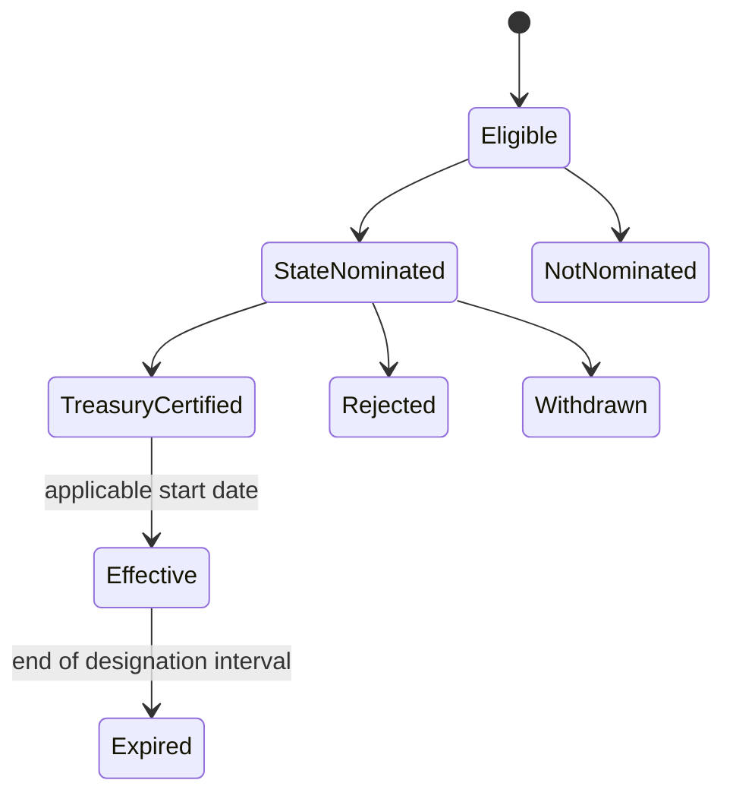

# Opportunity Zones and nationwide data design

Research cutoff: **August 12, 2026**. This document is architecture guidance, not tax or legal advice. Program rules and designations must be revalidated against current Treasury/IRS authority before each release.

## 1. Why Opportunity Zone status is temporal

[Public Law 119-21 §70421](https://www.congress.gov/119/plaws/publ21/PLAW-119publ21.pdf), enacted July 4, 2025, made the Opportunity Zone incentive permanent through decennial designation rounds and changed eligibility, rural incentives, and reporting.

The first new determination date was July 1, 2026. [Revenue Procedure 2026-14](https://www.irs.gov/pub/irs-drop/rp-26-14.pdf) opened the nomination process for zones intended to become effective January 1, 2027. As of this document's cutoff date, the nationwide 2027 designations are **not final**. State-published selections are provisional until Treasury certification/designation and the applicable effective date.

The platform must concurrently handle:

- legacy 2018 designations based on their original 2010-vintage legal tract geography;
- 2027 candidates, state nominations, and eventual designations using the new cohort rules;
- overlap during 2027–2028, because [Notice 2026-40](https://www.irs.gov/pub/irs-drop/n-26-40.pdf) says legacy designations generally continue through December 31, 2028 (Puerto Rico legacy zones through December 31, 2027), while 2027 designations run January 1, 2027 through December 31, 2036;
- future decennial cohorts with different data vintages and policy versions.

Therefore this is invalid:

```text
parcel.is_opportunity_zone = true
```

Use versioned designation facts and date-aware membership instead.

## 2. Current federal source hierarchy

### Legally authoritative designation and guidance sources

- [Public Law 119-21](https://www.congress.gov/119/plaws/publ21/PLAW-119publ21.pdf)
- [Revenue Procedure 2026-14](https://www.irs.gov/pub/irs-drop/rp-26-14.pdf) and its [eligible-tract appendix](https://www.irs.gov/pub/irs-drop/rp-26-14-appendix.xlsx)
- [Notice 2026-40 transitional guidance](https://www.irs.gov/pub/irs-drop/n-26-40.pdf)
- [Notice 2018-48 legacy designations](https://www.irs.gov/pub/irs-drop/n-18-48.pdf)
- [Notice 2019-42 Puerto Rico additions](https://www.irs.gov/pub/irs-drop/n-19-42.pdf)
- [Notice 2025-50 rural substantial-improvement guidance](https://www.irs.gov/pub/irs-drop/n-25-50.pdf)
- [IRS Opportunity Zones portal](https://www.irs.gov/credits-deductions/businesses/opportunity-zones)

### Machine-readable and methodology sources

- [Treasury Qualified Opportunity Zones data hub](https://home.treasury.gov/policy-issues/tax-policy/data-transparency/qualified-opportunity-zones)
- [2027 eligibility methodology](https://home.treasury.gov/system/files/131/OZ2-Eligibility-Criteria-Data-Transparency-03232026.pdf)
- [2027 rural methodology](https://home.treasury.gov/system/files/131/OZ2-Rural-Area-Notice-Methodology-Data-Transparency-03232026.pdf)
- [CDFI Fund Opportunity Zone resources](https://www.cdfifund.gov/opportunity-zones)

Treasury's data page is a valuable publication hub but expressly warns that it cannot be relied on to substantiate a tax-return position. Store whether a source is legal authority, official derivative, state nomination, or analytical context.

## 3. 2027 cohort lifecycle

At the research cutoff, Treasury/IRS identify 25,332 eligible low-income-community tracts, including 8,334 classified as entirely rural. Eligibility is not designation.

Represent the lifecycle as:



State nominations may be revised during the allowed process. Snapshot state publications and retain transaction time. Do not overwrite the prior nomination set or promote it to `treasury_certified` without Treasury authority.

### Implemented 2018 geography foundation

The isolated importer at `seekandscore.geography.opportunity_zones` implements the frozen 2018 CDFI archive only. It verifies the reviewed archive's exact SHA-256 and byte count, rejects unsafe ZIPs, requires exactly 8,764 unique 11-character GEOIDs, preserves the archive's 2010-vintage EPSG:3857 multipolygons, and loads the complete set transactionally behind a PostGIS validity check and GiST index. The reviewed archive contains exactly one invalid source topology; its immutable ZIP remains the source of truth, while the database records a deterministic `ST_MakeValid` polygon extraction and explicit per-tract repair lineage. Any future repair-count change fails closed.

The importer is inert by default. A run requires both:

```text
OZ_2018_IMPORT_ENABLED=true
OZ_2018_IMPORT_ACTIVATION_ID=SRC-CDFI-QOZ-2018-IMPORT-20260813-V1
```

It also requires staging or production, PostGIS, and durable S3-compatible artifact storage. The kill switch is `OZ_2018_IMPORT_ENABLED=false`; no Railway schedule or production activation is committed. The command is:

```bash
python -m seekandscore.geography.opportunity_zones run
```

Replaying the identical artifact verifies the stored tract set and records `succeeded_unchanged`; it never overwrites a conflicting or partial frozen layer. The importer separately records `treasury_certified` lineage and the currently `effective` legacy interval from Notice 2026-40. Puerto Rico tracts retain their exact December 22, 2017–December 31, 2027 interval; other 2018 designations use year-precision 2018 start metadata and a December 31, 2028 end. Year precision is explicit so January 1 is never mistaken for an exact certification date. None of these statuses is a parcel-level tax eligibility claim. The separate 2027 eligibility source has no import adapter and is prohibited from producing `effective` records.

The platform should poll Treasury/IRS and participating state sources frequently during nomination/certification periods and less frequently after the cohort is effective. Every publication is stored with URI, retrieval timestamp, effective/release date, SHA-256, parser version, and raw object location.

## 4. Designation schema

Recommended tables and essential fields:

### `oz_program`

```text
id
name
statutory_authority_uri
jurisdiction
created_at
```

### `oz_designation_round`

```text
id
program_id
round_code                 # 2018, 2027, 2037...
census_vintage             # 2010, 2020...
nomination_opens_at
nomination_closes_at
effective_from
effective_to
policy_rule_version_id
authority_uri
```

### `oz_tract_status_observation`

```text
id
designation_round_id
tract_geoid                # 11-character text, never numeric
status                     # eligible, state_nominated, treasury_certified,
                           # effective, expired, rejected, withdrawn, superseded
rural_status               # true, false, unknown
rural_authority_uri
effective_from
effective_to
recorded_at
source_id
source_artifact_id
confidence
```

### `oz_tract_designation`

The resolved, date-aware designation fact selected from authoritative observations. It retains lineage to every observation and must never erase a conflict.

### `parcel_oz_membership`

```text
parcel_geometry_version_id
oz_tract_geometry_version_id
designation_round_id
relationship               # within, overlaps, touches, unresolved
point_on_surface_within
parcel_area_overlap_ratio
intersection_geometry_id   # optional, retained when allowed/valuable
calculation_version
calculated_at
quality_flags
confidence
```

The durable tract key is at least:

```text
(designation_round, census_vintage, tract_geoid, effective_from, effective_to)
```

`tract_geoid` alone is not a durable identity across Census vintages.

## 5. Census geography rules

- Legacy Opportunity Zones retain the tract numbers and boundaries used for their designation. [IRS Announcement 2021-10](https://www.irs.gov/irb/2021-22_IRB) makes clear that later Census tract changes do not alter those zones.
- The 2027 cohort uses 2020 Census tract geography for designation. Store the exact official source release/checksum used to construct the frozen legal layer.
- Obtain authoritative boundary files from [Census TIGER/Line](https://www.census.gov/geographies/mapping-files/time-series/geo/tiger-line-file.2020.html).
- Use [2010-to-2020 relationship files](https://www.census.gov/geographies/reference-files/2020/geo/relationship-files.html) only as weighted analytical bridges. A crosswalk never transfers legal designation from one tract to another.
- ZIP codes are delivery constructs. [ZCTAs](https://www.census.gov/programs-surveys/geography/guidance/geo-areas/zctas.html) and the quarterly [HUD-USPS crosswalk](https://www.huduser.gov/portal/datasets/usps_crosswalk.html) can support aggregation, never parcel-level Opportunity Zone determination.
- Geocoded addresses can be interpolated. Record provider, benchmark, vintage, match type/score, and coordinates, then intersect with the frozen tract layer. Prefer verified parcel geometry over address centroids.

For a boundary parcel, the UI should say, for example:

```text
Overlaps 2027 QOZ tract 48123456789
82.4% of current parcel geometry by area
Treasury-certified; effective 2027-01-01
Boundary membership confidence: 93%
Professional eligibility review required
```

It should not collapse the result to an unexplained badge.

## 6. Eligibility and rural status

For the 2027 candidate set, Treasury's published methodology uses a low-income-community test based on median family income and poverty metrics. The exact ACS variables, comparison area, missing-value treatment, and thresholds belong to a versioned federal-policy dataset; do not reimplement them from memory.

Rural status uses place, urban-area, block, adjacency, and de-minimis intersection methodology. Ingest Treasury's official published rural flag and authority. Do not derive it from a tract centroid or a homegrown urban/rural shortcut.

The product may expose eligibility features for research, but it must distinguish:

- `eligible for state nomination`;
- `state nominated`;
- `Treasury certified/designated`;
- `currently effective`;
- `rural under the applicable program definition`.

## 7. Opportunity Zone investment lens

Opportunity Zone location is an eligibility gate and policy context, not a substitute for property quality. Model property economics independently, then add a separate, versioned tax/development scenario.

### Proposed Opportunity Zone strategy inputs

- effective designation and boundary-membership confidence;
- designation time remaining and policy-rule version;
- rural status from authoritative source;
- current basis and independently estimated market value;
- original-use/substantial-improvement scenario inputs;
- improvement budget, schedule, contingency, and financing capacity;
- zoning/use feasibility and entitlement risk;
- site control, access, utilities, hazards, and buildability;
- operating-business/property-use assumptions;
- local demand, job/population trends, liquidity, and exit scenarios;
- fund/entity/taxpayer assumptions entered by the operator;
- legal/tax review status and unresolved requirements.

### Outputs

- `oz_location_status`: factual tract result;
- `oz_development_suitability_score`: deterministic property/project measure;
- low/base/high project economics without tax benefit;
- a separate low/base/high tax scenario, when the user supplies valid assumptions;
- policy and evidence confidence;
- required professional-review checklist;
- explicit reasons the scenario is ineligible, provisional, or incomplete.

Never add a speculative tax benefit directly to base market value. Never label a project “QOZ eligible” solely because its parcel intersects a tract.

## 8. Nationwide source architecture

There is no comprehensive, current, official federal parcel-level deal feed. Nationwide scale combines stable federal layers with jurisdiction and licensed-provider adapters.

| Capability | Primary official source class | Notes |
|---|---|---|
| OZ eligibility/designation | Treasury, IRS, CDFI, state nomination authorities | Snapshot rapidly through 2026; cohort/status-aware |
| Demographics/housing | [ACS 5-year API](https://api.census.gov/data/2024/acs/acs5.html) | Annual; retain estimate, margin of error, release, and vintage |
| Parcel/assessment | County/local assessor or authorized statewide aggregator | Schemas, fees, completeness, and rights vary |
| Deeds/liens/ownership | Recorder/clerk or licensed provider | Separate legal records from assessor owner-of-record |
| Tax distress/auction | Tax authority, sheriff, court, trustee/public-notice source | State process and redemption/title rules vary |
| Zoning/permits/utilities | Local planning/permitting/utility authority | Coverage and semantics are highly local |
| Flood | [FEMA products/NFHL](https://www.fema.gov/flood-maps/products-tools) and [OpenFEMA](https://www.fema.gov/about/reports-and-data/openfema) | Retain effective map/version; screening, not determination |
| Environmental | [EPA ECHO/FRS](https://echo.epa.gov/tools/data-downloads) and [Superfund data](https://www.epa.gov/superfund/superfund-data-and-reports) | Screening only; durable EPA facility joins use published IDs |
| Housing/price context | [FHFA HPI/UAD](https://www.fhfa.gov/data) | Aggregate context, not parcel appraisal |
| Jobs/wages | [BLS QCEW](https://www.bls.gov/cew/questions-and-answers.htm) and LAUS | Revisions/suppression must be retained |
| Commuting | [Census LODES](https://lehd.ces.census.gov/data/lodes/LODES8/) | Annual and lagged; vintage-aware |
| Regional economy | [BEA Regional API](https://apps.bea.gov/api/_pdf/bea_web_service_api_user_guide.pdf) | Preserve vintage/revisions |
| Building supply | [Census Building Permits](https://www.census.gov/construction/bps/) | Monthly/annual jurisdiction coverage |
| Listings/sales | MLS or licensed provider | Contract-dependent; never assume scraping/redistribution |

The [HUD national parcel database feasibility study](https://www.huduser.gov/portal/publications/polleg/feasibility_natl_db.html) documents why local parcel data needs adapter and rights-management infrastructure.

## 9. Source snapshot and rights metadata

Every source version/artifact stores:

```text
source_id
authority_level
original_uri
retrieved_at
published_at / effective_at
sha256
media_type
schema_version
geographic_vintage
adapter_version
parser_version
terms_uri
terms_accepted_at
license_or_rights_statement
retention_allowed
internal_use_allowed
display_allowed
export_allowed
redistribution_allowed
attribution_text
personal_data_classification
raw_object_uri
```

Source rights are enforced in export/display services. Public visibility of a government search page does not itself grant bulk access, storage, or redistribution rights.

## 10. Public repository data policy

May be committed:

- code, schemas, region/source manifests, tests, documentation;
- tiny synthetic fixtures;
- small, clearly licensed/open federal examples with attribution and retrieval metadata.

Must not be committed:

- MLS or other licensed records;
- bulk parcel/owner/contact data;
- court/foreclosure documents containing unnecessary personal information;
- source credentials, session data, tokens, or access keys;
- data whose terms prohibit redistribution;
- production database dumps or object-store paths containing secrets.

Relevant federal-use notes include the [Census API terms](https://www.census.gov/data/developers/about/terms-of-service.html) and [BLS terms](https://www.bls.gov/developers/termsOfService.htm). Adapter descriptors should carry the required attribution/access-date language.

## 11. Expansion acceptance test

A new market is ready for active ranking only when:

- jurisdiction and legal geography are registered with stable IDs/vintages;
- source rights and access methods are approved;
- raw acquisition and replay are proven;
- parcel identity reaches the agreed benchmark on a reviewed gold set;
- minimum ownership, value, and geometry coverage gates are met;
- local foreclosure/tax/zoning semantics are mapped, not assumed from Texas;
- score overrides are reviewed and backtested;
- Opportunity Zone cohort membership uses the correct frozen tract layer;
- shadow rankings are manually reviewed before alerts or Top-25 inclusion;
- source freshness and failure runbooks are operational.
