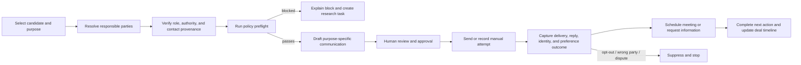

# Owner and representative outreach workflow

## 1. Purpose and boundary

Seek and Score should help an operator identify the correct property decision-maker, request information, and coordinate a conversation or site visit without turning the product into an autonomous marketing platform.

The workflow is deliberately **case-based and human-directed**:

- one candidate and declared business purpose per outreach case;
- only a verified owner or a source-supported representative is eligible;
- every contact point retains provenance, permitted use, confidence, and review history;
- every first contact requires an explicit human approval;
- policy preflight can block an action but never declares that an action is legally permissible;
- a reply, opt-out, wrong-party report, dispute, or channel failure immediately changes what may happen next;
- cold acquisition outreach is never relabeled as a transactional message merely because it uses a scheduling template.

This is product and engineering guidance, not legal advice. Counsel must approve each campaign purpose, jurisdiction, data source, channel, template, and operating policy before production activation.

## 2. Product principles

1. **Resolve the party before the contact point.** A phone number or email address is not evidence that its holder owns or manages a property.
2. **Authority is role-specific.** A registered agent may route a request but is not automatically authorized to negotiate a sale. A broker, manager, trustee, executor, attorney, or public-asset officer needs evidence of the relevant role.
3. **Use the least intrusive channel.** Manual, individually reviewed outreach comes before any sequence or automation.
4. **One suppression ledger.** Opt-outs and wrong-party reports apply across cases according to their recorded entity, contact-point, property, organization, channel, scope, and jurisdiction.
5. **No distress exploitation.** Distress evidence may prioritize internal research; it must not be used to shame, threaten, discriminate, or create a misleading sense of urgency.
6. **No protected-class targeting.** Protected characteristics and proxies are not targeting, prioritization, cadence, price, or message variables.
7. **No inferred relatives or occupants.** Do not contact tenants, neighbors, relatives, or similarly named people merely because they may know the owner.
8. **Outcomes do not rewrite investment merit.** A reply can change a deal's next action or evidence, but response behavior does not automatically change the opportunity score.

## 3. Responsible-party resolution

The identity module records a source-supported `PropertyPartyAssignment` between an entity and a parcel/candidate. The engagement module may use, but not invent, that relationship.

Supported roles include:

| Role | Typical evidence | Outreach limitation |
|---|---|---|
| `record_owner` | assessor, deed, recorder, or verified ownership document | verify currency and ownership interval |
| `authorized_signatory` | entity resolution, board/manager authority, signed authorization | authority must cover the requested action |
| `asset_manager` / `property_manager` | management agreement, official company directory, owner confirmation | may provide information; sale authority is separate |
| `listing_broker` / `broker_representative` | active listing or signed representation evidence | respect representation and channel instructions |
| `trustee` / `executor` / `personal_representative` | court, trust, or probate evidence appropriate to the use | manual legal/identity review required |
| `attorney` | confirmed representation for the property or matter | do not bypass confirmed counsel |
| `registered_agent` | current official entity-registration record | routing role only unless other authority is verified |
| `public_asset_officer` | official agency directory or disposition record | follow public procurement/disposition process |

Each assignment carries:

```text
entity_id, candidate_id/parcel_id, role,
authority_scope, source_observation_ids,
effective_from/to, observed_at, confidence,
verification_state, reviewed_by/at, dispute_state
```

Eligible contact points have their own evidence. A contact point is `unverified`, `verified`, `disputed`, `stale`, or `suppressed`; it is never treated as verified solely because a vendor returned it.

## 4. End-to-end workflow



### Step 1 — declare the purpose

The operator starts from a candidate and chooses one narrow purpose:

- verify ownership or representative authority;
- ask whether the party is open to a conversation;
- request property, tenancy, access, utility, environmental, title, or operating information;
- propose a call, meeting, property tour, inspection, or records review;
- contact the verified listing broker or public disposition officer;
- continue a conversation the party has affirmatively begun.

The case records strategy, property, organization, initiating user, jurisdiction/time zone, and any deal relationship. Combining unrelated candidates into a bulk campaign is out of scope for the first release.

### Step 2 — resolve and review the party

The system displays candidate roles, evidence, authority limits, ownership dates, match confidence, and unresolved conflicts. An operator chooses a participant only after resolving ambiguity. A mismatched, deceased, dissolved, represented, or contested party creates a research task instead of a message.

### Step 3 — verify the contact point and allowed use

For every address, email, or phone number, retain:

```text
source_id and source record
collection method and observed date
provider terms/policy version
declared permitted purpose and restrictions
entity match evidence and confidence
validation result and last validation time
channel type and time zone basis
consent/permission evidence, when applicable
retention and deletion rule
```

Contact data classified by a provider as consumer-report data, or subject to an unverified permissible-purpose requirement, remains blocked until counsel and source governance approve the exact use.

### Step 4 — policy preflight

Preflight evaluates the most restrictive result from the federal baseline, state/local policy pack, organization policy, source policy, campaign purpose, contact permission, and suppression ledger. It returns versioned reasons rather than a bare pass/fail.

Checks include:

- participant role and authority evidence;
- contact-point source, permitted use, freshness, and confidence;
- global, entity, contact-point, property, channel, and organization suppressions;
- consent/permission basis and revocation state where required;
- approved channel and human-approval requirement;
- local-time quiet hours and organization frequency caps;
- national/state do-not-call workflow where counsel determines it applies;
- honest sender identity, purpose, reply path, and required physical address/disclosures;
- approved template/version and prohibited sensitive variables;
- representation, dispute, bankruptcy, probate, or other configured escalation flags;
- campaign and jurisdiction legal-review record.

Preflight expires when any material input changes and runs again immediately before sending.

### Step 5 — draft and approve

Templates are versioned by purpose, jurisdiction, channel, and language. They use only approved variables. AI may propose a draft from selected evidence, but the system must mark it as generated, prohibit unsupported facts or numerical offers, and require human review.

The approval view shows the exact recipient, role, property, source, purpose, message, attachments, policy decision, local time, prior attempts, and suppression status. Approval is single-use: editing the recipient, channel, material message content, or attachment invalidates it.

### Step 6 — send or log the attempt

The first release supports individually approved messages and manual-attempt logging. It does not support unattended queues, bulk campaigns, predictive dialers, prerecorded messages, number rotation, or automatic multi-channel sequences.

Each attempt records sender, approver, provider/manual method, timestamps, provider identifiers, content/template hash, policy version, disposition, and immutable audit reference. Provider callbacks are authenticated, idempotent, and store only the data needed for operations.

### Step 7 — classify the outcome

An operator or inbound adapter records one of: verified party, authorized representative, referral to another verified party, interested, not interested, do not contact, wrong party, disputed identity, needs information, meeting requested, represented, bounced/invalid, or no response.

Stop rules take priority over follow-up rules. `do_not_contact`, revocation, wrong-party, disputed identity, permanent bounce, or a configured representation block cancels pending actions and invalidates unused approvals.

### Step 8 — coordinate an appointment

After an affirmative interaction, the operator may propose time slots in the participant's time zone for a call, meeting, site visit, inspection, or records review.

- Show exact time zone, duration, attendees, role, purpose, location/method, and access instructions.
- Do not expose private calendar detail; exchange only availability.
- The participant confirms before booking. Calendar invites use stable event IDs so reschedules update instead of duplicate.
- Confirmation/reminder messages use the permission and channel established by the interaction. An appointment label alone does not make a cold message transactional.
- Cancellation, reschedule, no-show, and completion are audited and stop obsolete reminders.
- An `.ics` download and manual confirmation are the provider-neutral MVP; calendar adapters are optional and isolated.

### Step 9 — request information securely

An information request is a structured checklist, not an email-thread attachment dump. Requested items can include surveys, title commitments, leases/rent rolls, operating statements, utility records, environmental reports, permits, zoning correspondence, tax statements, easements/access evidence, maintenance history, or proof of representative authority.

Each item records purpose, necessity, requested format, due date, sensitivity, provider/source, status, and verification result. Sensitive documents use a short-lived signed upload link, malware scanning, encryption, authorization, access audit, retention policy, and explicit prohibition on public fixtures/logs. Email attachments are not the default for restricted documents.

## 5. Channel activation matrix

The matrix is a safe product default, not a conclusion about which law applies to a particular acquisition campaign.

| Channel | Initial state | Minimum product controls |
|---|---|---|
| Manual phone call | `blocked_until_legal_review` | verified party/number, suppression and configured DNC check, approved local-time window, truthful identity/purpose, manual dialing, attempt log |
| Individual commercial email | `blocked_until_legal_review` | verified permitted source, accurate sender/subject, approved content and postal address, working opt-out, suppression before send, human approval |
| Postal mail | `blocked_until_legal_review` | verified deliverable source, truthful identity/purpose, return address, suppression/source-policy checks, approved template |
| SMS/MMS | `disabled` | enable only after counsel approves purpose and documented channel-specific permission/consent plus revocation handling |
| Automated dialing or prerecorded/artificial voice | `disabled` | outside initial product scope; requires separate legal/design approval and consent controls |
| Automated or bulk sequence | `disabled` | outside initial product scope; no implicit activation through provider configuration |
| Appointment confirmation/reminder | `relationship_required` | affirmative interaction, approved channel, content limited to the requested coordination, cancellation/revocation handling |

The safe default treats unsolicited acquisition email as commercial and applies CAN-SPAM controls unless counsel records a different classification. The system does not infer that the federal Telemarketing Sales Rule, a state solicitation statute, or a do-not-call regime does or does not apply; that scope is campaign-specific policy reviewed by counsel.

For product safety, cold acquisition phone/text campaigns are classified as solicitation unless a versioned counsel decision for the complete campaign records a narrower treatment. A `direct_purchase_only` campaign must be kept distinct from any `brokerage_or_service` promotion. Where a do-not-call check is required, the artifact/version used must meet the configured freshness rule; the federal safe-harbor workflow uses Registry data accessed no more than 31 days before the call. Seek and Score retains an internal suppression tombstone indefinitely by default unless an approved policy requires another period.

## 6. State models

### Outreach case

```text
draft -> needs_identity_review -> needs_policy_review -> ready_for_review
ready_for_review -> active -> responded -> scheduled/info_requested -> completed
any nonterminal state -> blocked | declined | wrong_party | no_response | suppressed | canceled
```

### Communication

```text
draft -> preflight_blocked | approval_required
approval_required -> approved -> sent/attempted -> delivered/replied
approved -> approval_invalidated | canceled
sent/attempted -> bounced | failed | suppressed
```

### Appointment

```text
proposed -> pending_confirmation -> confirmed
confirmed -> completed | reschedule_requested | canceled | no_show
reschedule_requested -> pending_confirmation
```

### Information request

```text
draft -> requested -> acknowledged -> partially_received -> received -> verified
requested/acknowledged/partially_received -> declined | overdue | canceled
```

Transitions are enforced server-side with actor, reason, timestamp, prior state, idempotency key, and policy snapshot.

## 7. Bounded context and core records

`identity` owns entities and source-supported property roles. A new `engagement` bounded context owns acquisition communication and its sensitive data. It is distinct from `delivery`, which sends the operator's own alerts and briefs.

| Aggregate/record | Purpose |
|---|---|
| `PropertyPartyAssignment` (`identity`) | entity-to-property role, authority scope, evidence, effective interval, confidence |
| `ContactPoint` / `ContactPointObservation` | channel endpoint, provenance, validation, permitted-use classification, lifecycle |
| `ContactPermission` | channel/purpose permission or consent evidence, capture method, scope, granted/revoked times |
| `SuppressionEntry` | scoped do-not-contact, wrong-party, invalid, legal, or source-policy block |
| `OutreachCase` / `Participant` | candidate, declared purpose, participants, assigned operator, status and next action |
| `PolicyDecision` | immutable preflight inputs, policy versions, result, reasons, expiry |
| `Communication` / `DeliveryAttempt` | exact content/version, approval, manual/provider attempt, delivery and reply disposition |
| `ConversationThread` | ordered inbound/outbound communications without making provider state authoritative |
| `Appointment` / `AvailabilityProposal` | proposed slots, participant time zone, confirmation and lifecycle |
| `InformationRequest` / `RequestedItem` | requested evidence, purpose, due date, sensitivity and receipt/verification state |
| `DocumentSubmission` | object pointer, checksum, uploader, scan/classification, access/retention policy |
| `EngagementOutcome` | structured result used by deal operations and workflow calibration |

## 8. API surface

The initial REST surface is command-oriented where state transitions or policy decisions matter:

```text
GET  /v1/candidates/{id}/responsible-parties
POST /v1/candidates/{id}/outreach-cases
GET  /v1/outreach-cases/{id}
POST /v1/outreach-cases/{id}/participants
POST /v1/outreach-cases/{id}/preflight
POST /v1/outreach-cases/{id}/communications/draft
POST /v1/communications/{id}/approve
POST /v1/communications/{id}/send
POST /v1/communications/{id}/record-manual-attempt
POST /v1/communications/{id}/record-outcome
POST /v1/outreach-cases/{id}/appointments
PATCH /v1/appointments/{id}
POST /v1/outreach-cases/{id}/information-requests
PATCH /v1/information-requests/{id}/items/{item_id}
POST /v1/suppressions
GET  /v1/outreach-cases/{id}/audit
```

`send` rejects if the environment kill switch is off, approval is absent/invalid, preflight is stale or blocked, or a new suppression exists. It never accepts an arbitrary recipient that is not a reviewed case participant.

Contact values are encrypted at rest and masked by default. Equality/deduplication uses a separately keyed HMAC of the normalized value, never a plain or merely salted contact hash. Reveal/copy/export is separately authorized and audited.

## 9. Domain events

```text
PropertyPartyResolved, PropertyPartyDisputed
ContactPointVerified, ContactPointStale, ContactPointSuppressed
ContactPermissionGranted, ContactPermissionRevoked
OutreachPreflightPassed, OutreachPreflightBlocked
CommunicationApproved, CommunicationSent, CommunicationDelivered
CommunicationReplied, CommunicationBounced, WrongPartyReported
DoNotContactRecorded
AppointmentProposed, AppointmentConfirmed, AppointmentRescheduled
AppointmentCanceled, AppointmentCompleted
InformationRequested, InformationPartiallyReceived
InformationReceived, InformationDeclined
EngagementOutcomeRecorded
```

Events carry internal IDs and policy/audit references, not message bodies or raw contact details. Deal operations consumes outcomes and tasks; ranking never consumes response behavior directly.

## 10. Operator interface

The candidate detail page adds `Resolve contact` and `Start outreach` actions plus an `Outreach` workspace:

- left rail: responsible parties, roles, confidence, authority evidence, and contact-point status;
- center: case timeline combining attempts, replies, appointments, requests, and outcomes;
- right action panel: purpose, preflight result, exact draft, required review, and next action;
- persistent stop/suppression action available without opening a secondary menu.

Design direction is a focused acquisition console: borders-only depth, an 8px spacing system, compact evidence rows, one restrained accent for current/approved actions, and red reserved for blocking policy states. Mobile views prioritize identity, block reason, and stop action before message composition.

## 11. Policy configuration and national scaling

Outreach policy is versioned configuration, separate from geography/source adapters but referenced by each region pack:

```text
federal baseline
  -> state/territory policy
    -> local policy when applicable
      -> organization policy
        -> source/contact restrictions
          -> campaign purpose and channel
```

The most restrictive result wins. Each policy pack declares effective dates, time-zone behavior, channel state, required checks/disclosures, frequency cap, escalation rules, legal-review ID/date, and tests. Unknown jurisdiction, missing legal review, stale DNC artifact, missing source rights, or conflicting permission fails closed.

National rollout requires a reviewed policy pack and contact-source policy for every enabled state; copying the Texas pack is not an activation path.

## 12. Security, audit, and operations

- Contact data and message bodies are restricted fields with role-based access and audit-on-read/export.
- Contact sources with consumer-report/FCRA restrictions require a specific permissible-purpose determination; generic prospecting is not assumed to qualify. DMV-derived personal data is rejected for solicitation unless documented consent/permitted use is approved.
- Precise movement, health/religious-location, protected-class, credit, financial-account, and similarly sensitive audience data is excluded from contact discovery and targeting.
- API, worker, logs, traces, fixtures, analytics, and error payloads use internal IDs and redact endpoints/content.
- Secrets are provider-scoped, server-side, least privilege, and absent from browser bundles.
- Inbound webhooks require signature verification, replay protection, raw-event retention policy, and idempotent processing.
- `OUTREACH_SEND_ENABLED=false` is the default in every new environment and preview.
- Provider adapters have per-channel kill switches; disabling one never prevents recording a manual response or suppression.
- Pending work is canceled when suppression or permission revocation arrives, including during queue delay.
- Call recording is off by default; state recording-consent policy is a separate activation decision.
- Audit retains actor, source, exact approved content hash, template/policy versions, preflight result, provider/manual outcome, and subsequent corrections.
- Operational metrics exclude raw contact details and include block reasons, approval latency, delivery failures, wrong-party rate, opt-out rate, time-to-response, appointment completion, request completion, and stale-contact rate.

## 13. Phased delivery

### Phase A — research and manual system of record

- party/authority review, contact provenance, suppression ledger, case/timeline;
- policy packs and explainable preflight in report-only mode;
- manual call/mail/email attempt logging; no provider sends;
- `.ics` appointment export and structured information-request checklist.

### Phase B — individually approved communication

- approved single-message email adapter behind an environment kill switch;
- inbound reply/bounce/opt-out handling;
- secure upload portal, appointment confirmation, provider reconciliation;
- legal/security test evidence and production activation checklist.

### Phase C — measured expansion

- approved calendar adapter and additional jurisdictions;
- channel enablement only through a new ADR, legal review, policy fixtures, and abuse testing;
- sequences, SMS, automated calls, or bulk tools remain separate future product decisions, not normal scale work.

## 14. Acceptance criteria

- No communication can be sent to an entity lacking a reviewed property role and a source-supported, permitted contact point.
- Every send has a fresh passing preflight, exact-content approval, actor, purpose, policy version, and immutable audit entry.
- A suppression or revocation received before provider handoff prevents the send; one received afterward cancels queued follow-up.
- Wrong-party and disputed-identity outcomes stop outreach and create a resolution task without corrupting identity history.
- Initial cold outreach is never automatically sent or classified as transactional.
- SMS, automated dialing, prerecorded/artificial voice, and bulk sequences remain technically disabled.
- Appointments require affirmative confirmation, preserve time zone, update idempotently, and honor cancellation/revocation.
- Information requests expose item purpose/status and use protected upload/access/retention controls for sensitive documents.
- Contact/message data does not appear in public fixtures, browser telemetry, logs, traces, ranking inputs, or AI prompts without explicit policy.
- State-policy fixtures prove that a missing or stricter regional rule blocks rather than falls back permissively.
- End-to-end tests cover approved send, stale approval, late suppression, wrong party, bounce, opt-out, reschedule, and secure document receipt.

## 15. Current official compliance references

The legal scope of a property-acquisition campaign depends on its facts; these references define controls to review, not automatic conclusions:

- [FTC CAN-SPAM compliance guide](https://www.ftc.gov/business-guidance/resources/can-spam-act-compliance-guide-business) — commercial-email identity, content, postal-address, opt-out, and vendor oversight requirements.
- [FTC Telemarketing Sales Rule compliance guide](https://www.ftc.gov/business-guidance/resources/complying-telemarketing-sales-rule) — calling windows, do-not-call, disclosures, recordkeeping, prerecorded-message, and seller/vendor responsibilities where the rule applies.
- [FCC rule, 47 CFR 64.1200](https://www.ecfr.gov/current/title-47/chapter-I/subchapter-B/part-64/subpart-L/section-64.1200) — current federal telephone-solicitation, consent, identification, and do-not-call rule text.
- [Telephone Consumer Protection Act, 47 USC 227](https://www.govinfo.gov/link/uscode/47/227) — statutory telephone-solicitation, autodialed/prerecorded call, do-not-call, and state-law framework.
- [HUD Fair Housing Act overview](https://www.hud.gov/helping-americans/fair-housing-act-overview) — protected classes and prohibited discrimination in housing-related activity.
- [FCRA permissible purposes, 15 USC 1681b](https://www.govinfo.gov/link/uscode/15/1681b) and [DPPA permitted uses, 18 USC 2721](https://www.govinfo.gov/link/uscode/18/2721) — source-lineage and permitted-use gates for consumer-report and motor-vehicle-derived data.
- [Postal false-representation statute, 39 USC 3005](https://www.govinfo.gov/link/uscode/39/3005) — review basis for truthful mail identity and the prohibition on official-looking deception.
- [Texas Business & Commerce Code Chapter 301](https://tcss.legis.texas.gov/resources/BC/htm/BC.301.htm) — Texas telephone-solicitation definitions and controls whose applicability must be reviewed for the campaign.

Record the retrieved/effective version used by counsel in the policy registry; a documentation link is not a substitute for monitored legal updates.
