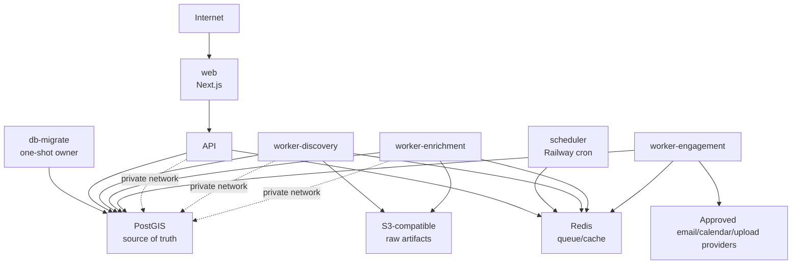

# Railway deployment plan

Research cutoff: **August 12, 2026**. Validate configuration fields against Railway's live schema and documentation during implementation because platform capabilities can change.

## 1. Deployment decision

Use Railway for the stateless application plane and MVP infrastructure:

- Next.js web service
- FastAPI service
- independently scalable worker services
- short-lived cron scheduler
- Redis queue/cache
- initial single-node PostGIS

Use S3-compatible object storage for source artifacts. For the first staging feed, prefer a private Railway Storage Bucket named `raw-artifacts` in `sjc`. Production storage remains a decision gate, and disaster recovery must not rely solely on storage inside the same Railway project.

Railway is a good fit for service deployment and private networking, but its database templates remain operator-managed. Backups, tuning, security, monitoring, upgrades, and recovery are our responsibility. See Railway's [database](https://docs.railway.com/databases) and [PostgreSQL](https://docs.railway.com/databases/postgresql) documentation.

## 2. Critical PostGIS constraint

Railway offers a [PostGIS template](https://railway.com/deploy/postgis), but Railway's native [PostgreSQL high-availability conversion](https://docs.railway.com/databases/postgresql-ha) supports its official PostgreSQL images and excludes custom images such as PostGIS/TimescaleDB. Railway's [volume reference](https://docs.railway.com/volumes/reference) also prevents ordinary replicated services from sharing an attached volume.

This creates an explicit decision gate:

### MVP

Use one Railway PostGIS node with:

- a pinned, tested image tag or digest (never the template's floating tag in production);
- private networking only;
- scheduled Railway volume backups;
- encrypted logical backups stored outside the Railway project/provider;
- database and storage monitoring;
- monthly automated restore verification;
- a documented recovery runbook and accepted RPO/RTO.

### Availability-critical production

Before strict uptime requirements or intolerable single-node risk, move PostGIS to a managed HA provider with full PostGIS support. Keep web/API/workers on Railway and update a reference/secret connection variable.

Do not self-manage Patroni/etcd/PostGIS on Railway for the first release; the operational burden is disproportionate to a single-operator MVP.

## 3. Service topology



| Service | Railway primitive | Public domain | Persistent volume | MVP replicas | Scale trigger |
|---|---|---:|---:|---:|---|
| `web` | persistent service | yes | no | 1 | 2+ at production launch or measured saturation |
| `db-migrate` | one-shot service | no | no | 0 between releases | runs exact release before API/ingestion |
| `api` | private persistent service | no | no | 1 | 2+ for availability/load; remain stateless |
| `worker-discovery` | persistent worker | no | no | 1 | source backlog/latency or rate-isolation needs |
| `worker-enrichment` | persistent worker | no | no | 1 | CPU/GIS/document backlog |
| `worker-engagement` | private persistent worker | no | no | 0 until M5 | approved-send/callback/upload backlog or provider isolation |
| `scheduler` | cron service | no | no | scheduled singleton | never performs long work |
| `ingestion-travis` | cron/one-shot service | no | no | 0 until approved | first bounded source proof only |
| `postgis` | database/image service | no | yes | 1 | migrate externally for HA, not replicas |
| `redis` | database/image service | no | yes | 1 | external managed/Sentinel when queue HA matters |
| `pgbouncer` | optional persistent service | no | no | 0 initially | connection count approaches safe DB limit |

Split additional workers by resource/risk class only when needed: OCR/document parsing, geocoding, valuation, ranking, and alert delivery can each get distinct queues and concurrency. Engagement is separated earlier for security: it receives only engagement-provider secrets and cannot run discovery or operator-alert jobs.

## 4. Monorepo deployment model

Railway maps each deployable process to a service. Its [monorepo documentation](https://docs.railway.com/deployments/monorepo) supports root directories, per-service commands/config, and watch paths.

Use the repository root as build context for services that consume shared Python packages, contracts, migrations, or lockfiles. Give each service:

- a dedicated Dockerfile or simple Railpack build;
- an absolute Railway config-file path such as `/infra/railway/api.toml`;
- root-relative watch patterns including every shared dependency;
- its own start command;
- a clear runtime role contract; only `db-migrate` owns schema migration.

Railway config files do not automatically follow a configured service root directory. A config path must be set explicitly. Watch paths must include shared contracts, migrations, and lockfiles or a dependency change may fail to redeploy the consumer.

### Build choice

- Use a multi-stage Dockerfile for Python API/workers because GIS, GDAL/GEOS/PROJ, OCR, or browser dependencies require deterministic OS packages.
- Railpack is acceptable for the Next.js web service if no special native dependency is needed.
- Do not start a new Nixpacks setup; Railway identifies Railpack as its successor.
- Pin language/toolchain versions and use deterministic lockfiles.
- Run application processes as a non-root user.

## 5. Config as code

Stable `railway.toml`/`railway.json` configuration is per service, not an entire-project blueprint. Railway's TypeScript project-level infrastructure-as-code is beta and mutually exclusive with service config for a controlled service; evaluate it in staging later, not as the MVP control plane.

Representative API configuration:

```toml
[build]
builder = "DOCKERFILE"
dockerfilePath = "infra/docker/api.Dockerfile"
watchPatterns = [
  "services/api/**",
  "python/seekandscore/**",
  "packages/contracts/**",
  "migrations/**",
  "pyproject.toml",
  "uv.lock",
  "infra/docker/api.Dockerfile"
]

[deploy]
startCommand = "/app/scripts/runtime/database-role-entrypoint.sh api python -m seekandscore.api"
healthcheckPath = "/readyz"
healthcheckTimeout = 300
restartPolicyType = "ALWAYS"
restartPolicyMaxRetries = 10
overlapSeconds = 15
drainingSeconds = 30
```

The separate `/infra/railway/db-migrate.example.toml` runs
`seekandscore.db.release apply` in pre-deploy and `verify` as its one-shot start.
It alone receives the database owner URL. Validate every config with Railway's
[Config as Code reference](https://docs.railway.com/config-as-code/reference)
and live schema.

API, worker, ingestion, and scheduler configurations never contain a migration
command. API and acquisition start only after their exact restricted role audit
passes. Unprovisioned worker classes deliberately refuse to start. The
scheduler adds a UTC cron expression only after its own role is approved and
must exit after enqueueing work.

## 6. Environments

| Environment | Data | Sources | Secrets | Deployment behavior |
|---|---|---|---|---|
| `development` | live-only or empty | explicitly activated official sources | local `.env` | Docker Compose or native tools |
| `staging` | isolated live records | bounded approved sources | distinct low-privilege | pinned deploy; outreach disabled |
| `production` | real records | approved production access | sealed production | protected main release |
| PR environment | live-only empty state | ingestion disabled | no source credentials | focused UI previews; outreach `disabled`; auto-remove on PR close |

Railway [environments](https://docs.railway.com/environments) isolate private networks. Sealed variables are not automatically copied to duplicated/PR environments; explicitly provision safe preview credentials.

All application deployments must set:

```text
INGESTION_ENABLED=false
ALERT_DELIVERY_MODE=log
DATASET_MODE=live
AI_ANALYST_ENABLED=false
OUTREACH_MODE=disabled
OUTREACH_SEND_ENABLED=false
```

With ingestion disabled and no source credentials, this produces an honest empty state rather than fixture candidates. It also prevents a UI pull request from scraping sources, contacting owners, or sending real alerts.

## 7. Networking

Only `web` receives a public domain. The API, PostGIS, Redis, workers, scheduler, and PgBouncer remain private. The web server calls the API through `API_BASE_URL` on Railway private networking; browser code must not receive or call a `*.railway.internal` origin.

Railway [private networking](https://docs.railway.com/networking/private-networking) supplies per-environment internal DNS over encrypted WireGuard. Services use names such as `postgis.railway.internal` and `redis.railway.internal`, ideally through reference variables rather than hardcoded hostnames.

Requirements:

- Bind application servers to Railway's injected `PORT` and an IPv6-compatible address (`::`) when using its dual-stack private network.
- Keep live API access server-side through the private origin. Browsers cannot reach `*.railway.internal`, and assigning the API a public domain would bypass the web access gate.
- Use application connection retries/backoff. GitHub-triggered monorepo service deploys are independent and there is no Docker Compose `depends_on` guarantee.
- Do not expose the database TCP proxy in production unless an approved operational need exists.
- If a source requires IP allowlisting, evaluate Railway Pro static outbound IPv4 and document that capability in the adapter descriptor.

## 8. Variables and secrets

Use Railway reference variables for non-owner internal services, for example:

```text
REDIS_URL=${{Redis.REDIS_URL}}
```

Never map `${{PostGIS.DATABASE_URL}}` to an application runtime. It is the owner
credential and belongs only on the private `db-migrate` service as
`MIGRATION_DATABASE_URL`.

Use shared non-secret variables for version/config identifiers and sealed service variables for secrets.

### Common application variables

```text
APP_ENV
LOG_LEVEL
PUBLIC_APP_URL
API_BASE_URL
ALLOWED_ORIGINS
WEB_PRIVATE_ACCESS_ENABLED
WEB_PRIVATE_ACCESS_USERNAME
WEB_PRIVATE_ACCESS_PASSWORD
DATABASE_URL
REDIS_URL
OBJECT_STORAGE_ENDPOINT
OBJECT_STORAGE_REGION
OBJECT_STORAGE_BUCKET
OBJECT_STORAGE_ACCESS_KEY_ID
OBJECT_STORAGE_SECRET_ACCESS_KEY
OBJECT_STORAGE_FORCE_PATH_STYLE
AUTH_SECRET / OIDC settings
OTEL_EXPORTER_OTLP_ENDPOINT
SENTRY_DSN
```

### Database role variables

Generate distinct 32-128 character URL-safe passwords and construct three
sealed URLs over Railway private networking. The migration service receives:

```text
MIGRATION_DATABASE_URL=${{PostGIS.DATABASE_URL}}
API_DATABASE_LOGIN_ROLE=seekandscore_api
API_DATABASE_PASSWORD=<sealed URL-safe value>
API_RUNTIME_DATABASE_URL=<sealed seekandscore_api URL>
INGESTION_DATABASE_LOGIN_ROLE=seekandscore_ingestion
INGESTION_DATABASE_PASSWORD=<different sealed URL-safe value>
INGESTION_RUNTIME_DATABASE_URL=<sealed seekandscore_ingestion URL>
```

The API receives only `DATABASE_URL=<seekandscore_api URL>`. Manual/monthly
ingestion and discovery receive only
`DATABASE_URL=<seekandscore_ingestion URL>`. They never receive
`MIGRATION_DATABASE_URL`, and their startup audits the exact `DATABASE_URL`
before executing application code. Enrichment, engagement, OZ importing, and
scheduling stay undeployed until each has a dedicated contract; no active
process may use the owner URL as a shortcut.

The web service is private-by-default in `staging` and `production`. Set
`WEB_PRIVATE_ACCESS_ENABLED=true`, store `WEB_PRIVATE_ACCESS_USERNAME` and a
generated high-entropy `WEB_PRIVATE_ACCESS_PASSWORD` of at least 24 characters
as sealed, server-only Railway variables, and never use the `NEXT_PUBLIC_`
prefix for either credential. Startup refuses missing or blank values. The request proxy protects
all pages, APIs, RSC requests, and assets with HTTP Basic authentication; only
the data-free `/api/health` Railway health check remains unauthenticated.

Basic authentication protects the web origin only. Do not expose a separate
public API domain when live display is enabled. Route the web service to the API
over Railway private networking with `API_BASE_URL`, or add an equivalent API
authentication boundary before assigning an API public domain.

### Source variables

Namespace credentials per adapter, such as `SOURCE_TCAD_*`. Never place source tokens in a shared browser-visible `NEXT_PUBLIC_*` variable. Rotate provider credentials independently and record owner/expiry in an external secret inventory.

For a Railway bucket displayed as `raw-artifacts`, map its native references only into acquisition services:

```text
OBJECT_STORAGE_BUCKET=${{raw-artifacts.BUCKET}}
OBJECT_STORAGE_ACCESS_KEY_ID=${{raw-artifacts.ACCESS_KEY_ID}}
OBJECT_STORAGE_SECRET_ACCESS_KEY=${{raw-artifacts.SECRET_ACCESS_KEY}}
OBJECT_STORAGE_REGION=${{raw-artifacts.REGION}}
OBJECT_STORAGE_ENDPOINT=${{raw-artifacts.ENDPOINT}}
OBJECT_STORAGE_FORCE_PATH_STYLE=false
```

Railway buckets are private, S3-compatible, region-fixed, and isolated by environment. As of the research cutoff they do not support server-side encryption controls, object versioning, object lock, lifecycle configuration, or native bucket backups. Content-addressed create-only writes and an external verified copy are required; do not describe a native bucket as immutable storage by itself.

### Engagement variables

Only API and `worker-engagement` receive the engagement policy ID, contact encryption/HMAC keys, approved provider credentials, sender identity, webhook secret, calendar settings, and secure-upload credentials. Web, discovery, enrichment, scheduler, and alert-delivery processes do not. `OUTREACH_MODE` is `disabled`, `log_only`, or `active`; `active` still requires channel-specific enablement plus server-side identity, preflight, approval, and suppression checks.

## 9. Database provisioning

1. Deploy the Railway PostGIS template into `staging`.
2. Replace any floating image reference with a tested stable tag/digest.
3. For the initial `postgis/postgis:17-3.5` service, mount the volume at `/var/lib/postgresql/data` and set `PGDATA=/var/lib/postgresql/data/pgdata`; the volume root contains `lost+found` and cannot itself be initialized as the database directory.
4. Keep it private.
5. Create the private `db-migrate` one-shot service and attach the owner URL only there.
6. Run its exact release SHA. Alembic creates NOLOGIN API/ingestion capability roles; the release command provisions distinct LOGIN roles and audits both restricted URLs.
7. Confirm API and ingestion refuse the PostGIS owner URL, DDL, cross-context writes, and extra role membership before attaching either service.
8. Run an idempotent baseline migration that verifies required extensions (`postgis` and only explicitly approved additions).
9. Set bounded application pools per API/worker replica.
10. Add GiST/SP-GiST and conventional indexes from measured query plans.
11. Configure Railway snapshots and the external logical-backup job.
12. Complete a restore test before loading non-reproducible production data.

Do not assume point-in-time recovery works for the community PostGIS image; Railway's documented PITR depends on its own pgBackRest-enabled PostgreSQL image. Verify the actual deployed service before declaring PITR in the recovery objective.

## 10. Redis behavior

Redis supports Celery queues, short-lived locks, rate limits, and disposable caches. It is not the authoritative record of job status, source cursors, deduplication, events, or rankings.

- Store pending job intent and outcomes in Postgres.
- Publish jobs through a transactional outbox.
- Confirm persistence mode and volume behavior for the deployed Redis service.
- Define memory limits and an eviction policy that cannot silently delete live queues.
- Monitor queue depth, oldest job, memory, restarts, and failed deliveries.
- Rebuild queues/caches from Postgres after Redis loss.
- Move to managed HA Redis or an appropriate queue when availability/throughput requires it.

## 11. Scheduler and workers

Railway [cron jobs](https://docs.railway.com/cron-jobs):

- use UTC;
- have a five-minute minimum frequency;
- may run a few minutes late;
- skip the next run when the prior execution remains active;
- require the process to close connections and exit.

Therefore the scheduler performs one short transaction:

1. Acquire a Postgres advisory lock/idempotency key.
2. Determine due source jobs from the registry.
3. Insert durable job intents/outbox rows.
4. Publish/enqueue.
5. Release resources and exit successfully.

Long acquisition, parsing, spatial, scoring, delivery, or engagement work runs in always-on workers with Celery retry/dead-letter policies. Use separate queues and concurrency limits per source/provider to honor rate limits.

The `engage` queue accepts only durable intents created after exact-content approval. The worker repeats preflight and suppression checks inside the handoff transaction, uses provider idempotency keys, and records delivery uncertainty instead of blindly retrying. Authenticated API webhooks verify signatures and replay windows before appending provider events; projections tolerate duplicates and out-of-order delivery. No provider outage may bypass a new suppression.

## 12. Migrations and deploy ordering

The private `db-migrate` service is the only deployment unit with schema-owner
credentials. Do **not** put its URL or migration command on API, ingestion,
workers, or scheduler. Railway service variables are available to both
pre-deploy and runtime containers, so an API pre-deploy migration would expose
the owner secret to API remote-code execution even if normal queries used a
second URL.

Railway's [pre-deploy command](https://docs.railway.com/deployments/pre-deploy-command) runs after build and before application start, can access environment variables/private networking, uses a separate container without the service volume, is not retried, and blocks deployment on failure.

Migration requirements:

- deploy `db-migrate` at the exact release SHA and require both role audits to pass;
- deploy API and ingestion only afterward, with their own restricted `DATABASE_URL`;
- Postgres advisory lock prevents concurrent execution.
- Expand/contract changes remain compatible with the prior application and workers.
- Backfills are resumable background jobs, not long blocking schema migrations.
- Destructive column/table removal occurs in a later release after old code is drained.
- Migration, API, and worker images share one tested commit/schema contract.
- Production deployment has a database backup and rollback decision point.

## 13. Health, shutdown, and continuous monitoring

Expose:

- `/livez`: process is alive; no remote dependency required.
- `/readyz`: initialization succeeded and critical dependencies respond within tight timeouts.
- `/version`: commit SHA, build time, schema compatibility, and config versions without secrets.

Railway [health checks](https://docs.railway.com/deployments/healthchecks) gate a new deployment; they are not continuous monitoring. They require HTTP 200 and use the injected `PORT`. Allow the `healthcheck.railway.app` host where framework host validation applies.

Set a nonzero drain period. On SIGTERM:

- web/API stop accepting new requests and finish bounded in-flight work;
- workers stop reserving new jobs, safely return/retry unfinished jobs, and flush telemetry;
- scheduler exits without leaving locks/connections.

Use an external uptime monitor plus OpenTelemetry/error tracking for continuous application health.

## 14. Scaling and region choice

Railway horizontal scaling is manually configured; public traffic is distributed without sticky sessions. Keep session and job state outside API/web memory.

Start all latency-sensitive services in one region. Railway does not currently list a Texas/US Central region. Benchmark Virginia and California against:

- Central Texas operator latency;
- county/source endpoints;
- object-storage region;
- external PostGIS if selected.

Virginia is the initial hypothesis, not an unmeasured commitment.

Scaling order:

1. Fix slow queries, indexes, payloads, and worker concurrency.
2. Add PgBouncer/adjust bounded pools before API replicas exhaust connections.
3. Add API/web replicas for availability and measured load.
4. Split/scale workers by queue and bottleneck.
5. Add read projections/caches.
6. Move to managed HA data services before multi-region app replicas create cross-region database risk.

Nationwide coverage alone is not a reason for multi-region compute. A single-region source-of-truth database can make distant API replicas slower.

## 15. Backups and disaster recovery

Railway [volume backups](https://docs.railway.com/volumes/backups) can be scheduled but restore within the same project/environment and do not replace provider/regional disaster recovery.

### Proposed MVP policy

- Daily, weekly, and monthly Railway volume backups according to available retention.
- Daily encrypted logical PostGIS backup to an off-project storage location.
- SHA/checksum and restore logs for every backup.
- Automated monthly restore into an isolated database and validation of row counts, extensions, spatial indexes, migrations, and sample queries.
- Quarterly recovery exercise using the written runbook.
- Alert when the last good backup or restore verification exceeds its SLA.

### Proposed objectives requiring owner acceptance

| Stage | RPO | RTO | Notes |
|---|---:|---:|---|
| Development | best effort | best effort | reproducible fixtures only |
| MVP production | 24 hours | 4 hours | daily logical backup; source data may be replayable |
| Acquisition-critical | 1 hour | 2 hours | requires verified WAL/PITR or managed HA provider |

Deal notes, manual resolution decisions, engagement policy decisions, suppressions, approvals, communications, appointments, information requests, offers, and outcomes are less reproducible than source data; prioritize them in recovery verification. Restore tests must prove a retained suppression still blocks a reimported contact.

## 16. Observability on Railway

Railway provides container logs and infrastructure metrics, but application/source/business telemetry remains our responsibility. Emit single-line structured JSON and OpenTelemetry data.

Minimum production alerts:

- private API unavailable to the web service or error/latency threshold exceeded;
- source freshness SLA missed;
- repeated source authentication/rate-limit/schema failure;
- queue oldest-job age/depth exceeds threshold;
- dead-letter count increases;
- database connection/storage/slow-query threshold exceeded;
- PostGIS/Redis restart;
- backup age or restore verification stale;
- ranking/read-model snapshot too old;
- alert delivery failure rate elevated.
- engagement policy blocks/review backlog, provider uncertainty/failure, wrong-party and opt-out rate, and last successful suppression reconciliation.

Railway log throughput/retention is not an audit archive. Store durable audit events and important source/job outcomes in Postgres/object storage, then export telemetry to an approved external system.

## 17. Deployment sequence

### Gate 0 — before creating Railway resources

- Runnable web/API/worker scaffold exists.
- Offline parser fixtures and migrations pass locally; fixtures are never runtime candidates.
- `/livez` and `/readyz` exist.
- Source ingestion can be globally disabled.
- Secret inventory and owner are defined.
- Initial monthly spend ceiling and alerts are approved.

### Gate 1 — staging

1. Create Railway project and staging environment.
2. Provision pinned PostGIS and Redis privately.
3. Configure object storage and low-privilege staging credentials.
4. Create `web`, `db-migrate`, and `api`; create only the acquisition processes currently approved. Leave unprovisioned workers/scheduler stopped.
5. Assign per-service config paths, watch patterns, commands, and variables.
6. Deploy `db-migrate` at the exact SHA; verify Alembic head plus API and ingestion role audits, then deploy API with only its restricted URL.
7. Verify the live-only empty state before activating a bounded source; deploy ingestion only with its restricted URL.
8. Generate a public staging domain only for web; keep API and all data services private.
9. Verify network isolation, health, graceful shutdown, replay, and dead-letter flow.
10. Configure backups; perform and document a restore.
11. Run load and failure tests; record baseline cost/resource use.
12. Do not deploy engagement until its dedicated database role and separate activation are approved.

### Gate 2 — production shadow mode

1. Create isolated production environment and production credentials.
2. Re-run backup/restore and security checklist.
3. Enable approved sources one at a time with alerts/log delivery disabled.
4. Compare results to manually verified records.
5. Keep rankings internal and mark them shadow until data-quality thresholds pass.
6. Keep outreach disabled until the separate M5 legal/source/security activation gate passes; production data availability alone is not authorization to contact.

### Gate 3 — operator launch

1. Approve source freshness and parcel-resolution benchmarks.
2. Enable Top 25, watchlist, and internal alerts.
3. Review one full auction/source-refresh cycle.
4. Hold a recovery exercise and incident simulation.
5. Sign off on accepted single-node PostGIS risk or migrate to managed HA.

## 18. Release checklist

- [ ] CI passed for the exact commit
- [ ] schema migration is backward compatible and backup exists
- [ ] Railway config paths/watch patterns include shared dependencies
- [ ] production ingestion/alert flags are intentional
- [ ] outreach mode/channel flags are intentional; preview is disabled and unapproved staging is log-only
- [ ] no production secret entered in Git or public build variables
- [ ] source terms/access version remains approved
- [ ] new deployment passes readiness and prior deploy drains safely
- [ ] worker queue/retries are healthy
- [ ] data freshness and Top-25 snapshot advance
- [ ] smoke tests pass on web, API, map, source evidence, watchlist, and ranking explanation
- [ ] rollback and data-forward-fix owner identified
- [ ] provider webhook, idempotency, suppression-race, and kill-switch tests pass for any enabled engagement channel

## 19. Cost controls

- Tag/measure CPU, memory, network, storage, and task duration by service/source.
- Bound worker concurrency and source polling to actual freshness requirements.
- Use cron only for short dispatch work; scale idle worker pools deliberately.
- Add object lifecycle policies without deleting the only permitted raw record.
- Prevent production dependencies in PR environments.
- Set workspace/project spend alerts and review cost per source, parcel, and daily active operator.
- Revisit architectural extraction only when its operational savings exceed its added complexity.
